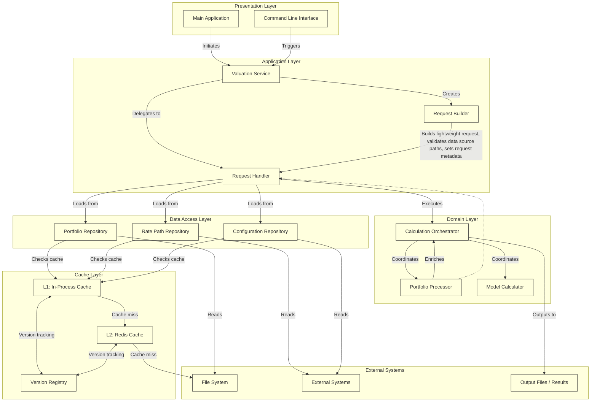
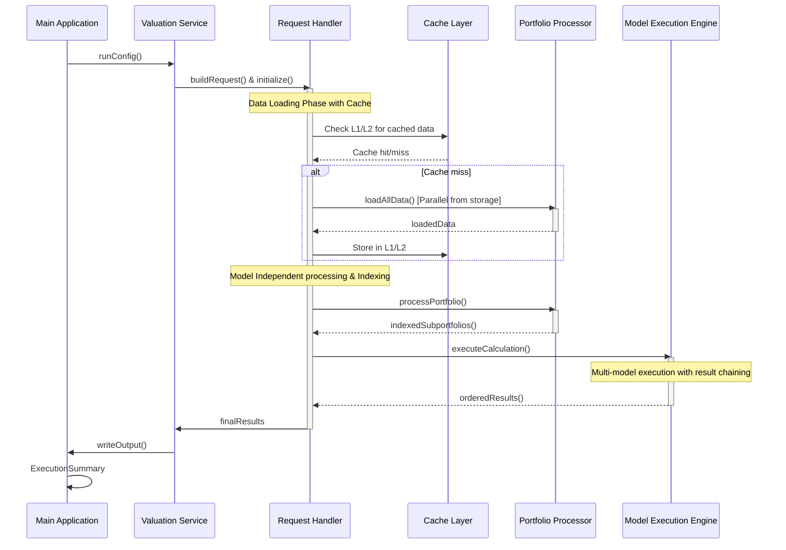
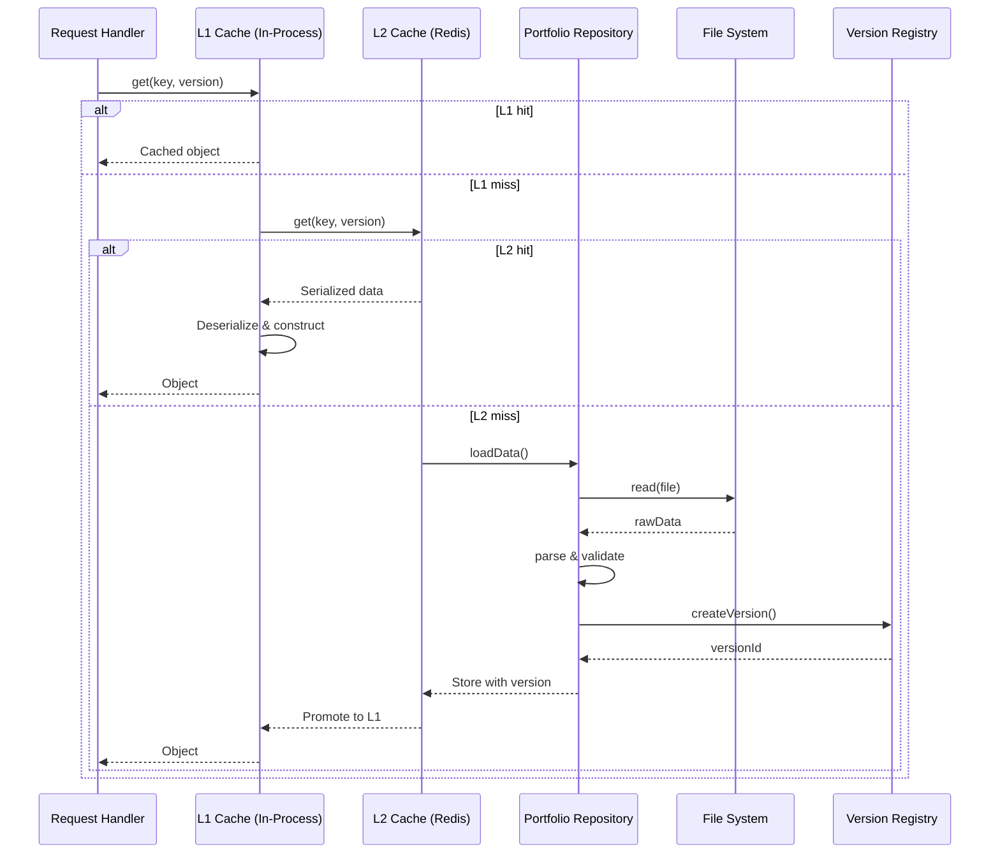
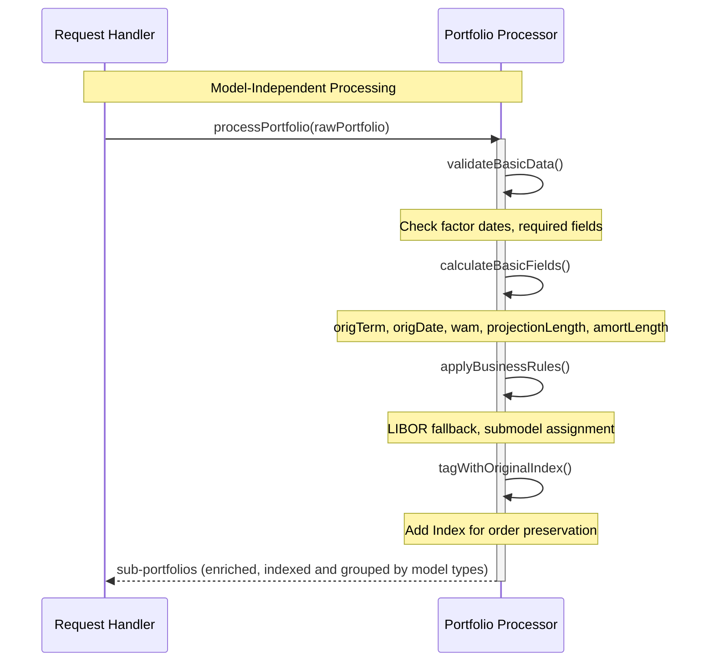
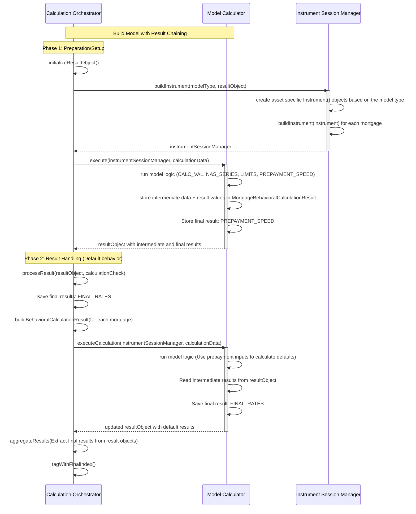
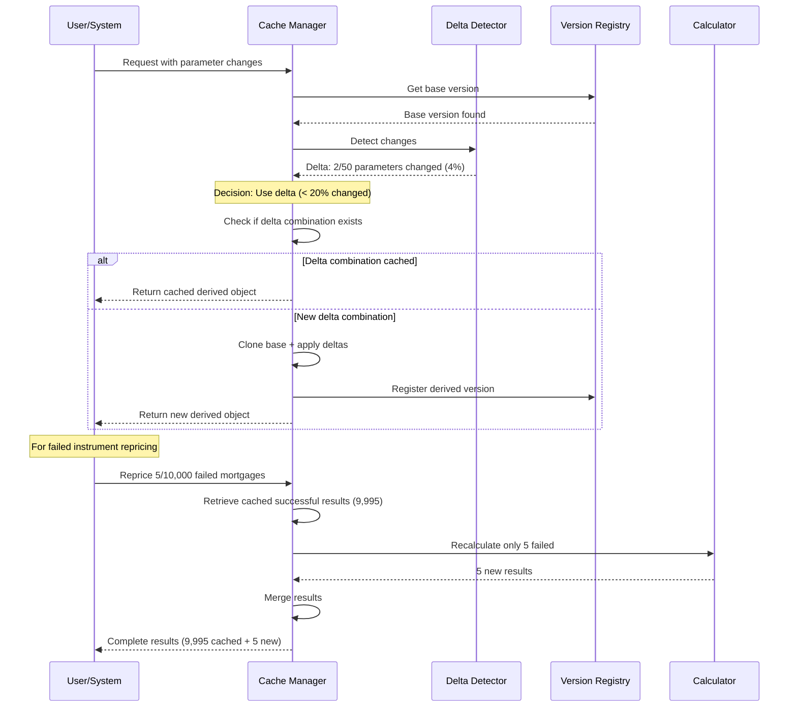
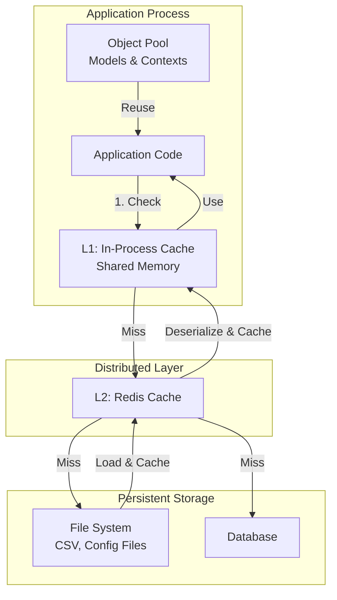
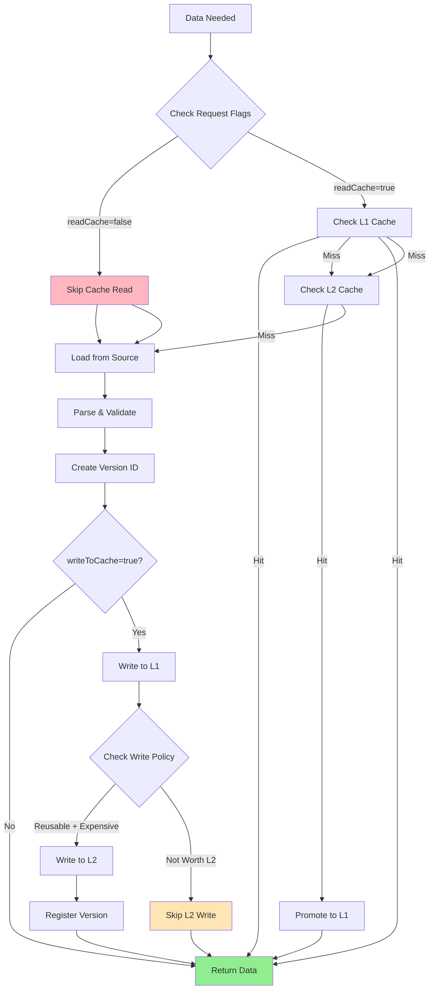
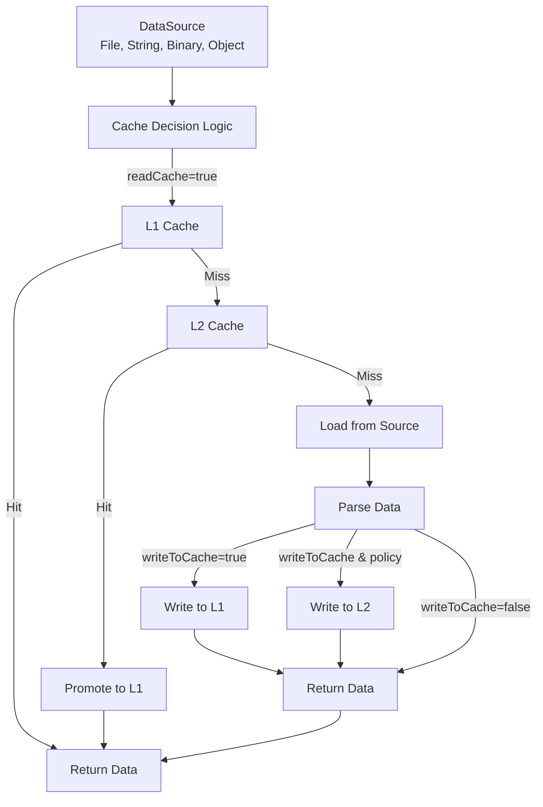
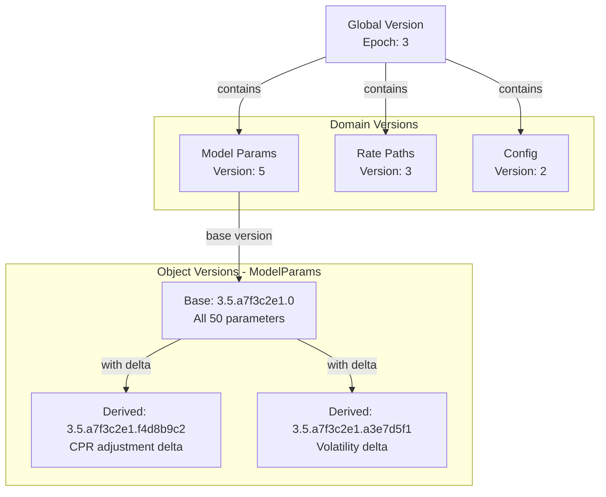

# High-Level Component Design with Caching and Versioning

This design document outlines the proposed architecture, component design, sequence flows, caching strategy, and versioning system for the MBS valuation system.

---

## Action Items for Design Improvement

1. **Define L1/L2 concurrency protocol (P0):** Implement versioned CAS or leases for L2→L1 promotion and safe invalidation.
2. **Make delta threshold adaptive (P0):** Measure materialization vs rebuild costs and auto-tune per object type.
3. **Transactional derived-version creation (P0):** Materialize to temp key → atomic rename/register → TTL fallback on failure.
4. **L2 resilience requirements (P0):** Specify replication, persistence, retry/backoff, failover and degraded-mode behavior.
5. **Cost-aware eviction policy (P1):** Evict by reconstruction cost + recency/frequency, limit derived-object growth.
6. **Version GC/prune plan (P1):** Reference counts + soft-deletes + async safe pruning under concurrent readers.
7. **End-to-end observability (P0):** Instrument L1/L2 hit rates, promotion latency, delta materialization time, registry ops.
8. **Transactional/ACL model for VersionRegistry (P1):** Who may register/deactivate/bump epochs; audit logs.
9. **Deterministic serialization & hashing (P1):** Canonical serialization and schema/version recorded with VersionId.
10. **Optional cross-worker reuse (P2):** Implement immutable result fingerprinting for safe sharing when beneficial.
11. **CI + test matrix (P0):** Benchmarks for delta vs full, compatibility tests, and chaos tests for Redis/registry failures.
12. **Resolve open questions (P0):** Expected reuse frequency, required consistency (strong vs eventual), and latency SLOs.
13. **~~Cache write strategy (P0): COMPLETED~~** Define when/how to write to cache, implement request-level cache control flags.

---

## Table of Contents

- [Proposed Architecture](#1-proposed-architecture)
  - [Architectural Principles](#11-architectural-principles)
  - [Layered Architecture](#12-layered-architecture)
- [High-Level Component Design](#2-high-level-component-design)
  - [Component Architecture Overview](#21-component-architecture-overview)
  - [Component Responsibilities](#22-component-responsibilities)
- [Sequence Flows](#3-sequence-flows)
  - [High-Level Architecture Flow](#31-high-level-architecture-flow)
  - [Data Loading with Cache](#32-detailed-flow-data-loading-with-cache)
  - [Portfolio Processing](#33-detailed-flow-portfolio-processing)
  - [Model Execution with Result Passing](#34-detailed-flow-model-execution-with-result-passing)
  - [Delta Change Workflow](#35-detailed-flow-delta-change-workflow)
- [Order Preservation Strategy](#4-order-preservation-strategy)
- [Caching Strategy](#5-caching-strategy)
  - [Two-Level Caching Architecture](#51-two-level-caching-architecture)
  - [What to Cache at Each Level](#52-what-to-cache-at-each-level)
  - [C++ Object Caching](#53-cpp-object-caching)
  - [Cache Performance Characteristics](#54-cache-performance-characteristics)
  - [Cache Write Strategy](#55-cache-write-strategy)
  - [Request-Level Cache Control](#56-request-level-cache-control)
- [Multi-Source Data Loading](#57-multi-source-data-loading)
- [Delta Change Handling](#6-delta-change-handling)
- [Versioning Design](#7-versioning-design)
  - [Versioning Overview](#71-versioning-overview)
  - [Hierarchical Version ID](#72-hierarchical-version-id)
  - [Version Registry](#74-version-registry)
  - [Version Compatibility & Lifecycle](#76-version-compatibility--lifecycle)
- [Deployment Considerations](#8-deployment-considerations)
- [Key Design Decisions](#9-key-design-decisions)
- [Future Enhancements](#10-future-enhancements)

---

## 1. Proposed Architecture

### 1.1 Architectural Principles

The design adheres to the following architectural principles:

- Separation of Concerns: Each component has a single, well-defined responsibility.
- Dependency Inversion: Depend on abstractions, not concrete implementations.
- Open/Closed Principle: Open for extension, closed for modification.
- Single Responsibility: Each class does one thing well.
- DRY (Don't Repeat Yourself): Eliminate duplicate code and calculations.

### 1.2 Layered Architecture

The system is structured into four distinct layers:

| Layer | Key Components / Responsibilities |
|-------|----------------------------------|
| Presentation Layer | Main, CLI, API Endpoints |
| Application Layer | MBSValuationService, RequestBuilder, Orchestration & Coordination |
| Data Access Layer | Repositories (CSV, File I/O), Infrastructure & External Systems |
| Domain Layer | CalculationEngine, PortfolioEnricher, Factory, Pure Business Logic |


## 2. High-Level Component Design

### 2.1 Component Architecture Overview

Component Architecture



### 2.2 Component Responsibilities

#### Presentation Layer

- Main Application: Entry point, configuration parsing, result output coordination.
- CLI (Command-Line Interface): User interaction, parameter validation.

#### Application Layer

- Valuation Service: Top-level orchestration of the entire valuation workflow. Manages component dependencies and lifecycle. Handles cross-cutting concerns (logging, error handling).

- Request Builder: Creates lightweight request objects containing only metadata and data source paths. Validates data source paths and accessibility. Sets request configuration and options. Does NOT load actual data - maintains separation of concerns.

- Request Handler: Processes valuation requests by coordinating data loading. Centralizes all data loading operations in one component. Enables asynchronous I/O operations (coroutines, parallel loading). Manages request execution lifecycle and error handling. Coordinates with domain layer for business logic execution. Integrates with cache layer for data retrieval.

#### Domain Layer

- Portfolio Processor: Model-Independent Data Validation, Model-Independent Business Rules, Model-Independent Basic Calculations, Portfolio enrichment and standardization, Index Tagging for order preservation.

- Calculation Orchestrator: Manages different calculation strategies, coordinates execution across multiple models, handles result aggregation, model-specific validation and result ordering.

- Model Execution Engine (Model Calculator): Delegates instrument object creation to InstrumentSessionManager, executes model-specific calculations, populates MortgageBehavioralCalculationResult.

#### Data Access Layer

- Portfolio Repository: Abstracts portfolio data access, handles CSV parsing, integrates with cache layer.
- Rate Path Repository: Manages rate data loading and validation, cache-aware.
- Configuration Repository: Handles model configurations and mapping specifications, cache-aware.

#### Cache Layer

- L1 (In-Process Cache): Shared memory cache for fast access within a single process. Stores both data and constructed C++ objects.
- L2 (Redis Cache): Distributed cache for sharing data across multiple worker processes.
- Version Registry: Centralized tracking of all object versions, version lineage, and compatibility checking.


## 3. Sequence Flows

### 3.1 High-Level Architecture Flow

This sequence diagram illustrates the main steps of a valuation request from start to finish.



### 3.2 Detailed Flow: Data Loading with Cache



### 3.3 Detailed Flow: Portfolio Processing

This phase is initiated by the `processPortfolio()` call and involves model-independent processing and enrichment.



### 3.4 Detailed Flow: Model Execution with Result Passing



### 3.5 Detailed Flow: Delta Change Workflow




## 4. Order Preservation Strategy

### 4.1 Problem

Portfolio grouping and multithreaded processing can disrupt the original input order.

### 4.2 Solution

The Calculation Orchestrator implements an order preservation strategy:

- Index Tagging in Portfolio Processor: The Portfolio Processor tags each mortgage with its original input position.
- Result Ordering in Calculation Orchestrator: The Calculation Orchestrator uses the originalIndex to ensure the final output is re-ordered to match the input.


## 5. Caching Strategy

### 5.1 Two-Level Caching Architecture

The system implements a two-level caching strategy to optimize performance for both single-machine and distributed deployments:



### 5.2 What to Cache at Each Level

| Data Type | L1 (In-Process) | L2 (Redis) | Rationale |
|-----------|-----------------|------------|-----------|
| Portfolio Data | ❌ No (too large, changes per request) | ⚠️ Partial (recent batches for retry) | Batch-specific, high volume |
| Rate Paths | ✅ Yes (frequently reused) | ✅ Yes (shared across workers) | Relatively stable, heavily reused |
| Model Parameters | ✅ Yes (stable reference data) | ✅ Yes (versioned) | Rarely changes, critical for consistency |
| Calculation Configs | ✅ Yes (per session) | ✅ Yes (shared configs) | Medium stability, moderate size |
| Session Data | ✅ Yes | ✅ Yes | Shared across multiple calculations |


### 5.3 C++ Object Caching

Safe to Cache (Immutable/Stateless)

- ✅ Model Parameter Sets: Pre-parsed, validated configuration
- ✅ Rate Path Data Structures: Pre-processed rate data
- ✅ Model Instances: Stateless calculator objects
- ✅ Configuration Objects: Parsed and validated settings

Use Object Pools (Stateful, Reusable)

- ⚠️ Calculation Contexts: Reset between uses
- ⚠️ Instrument Objects: Stateful during calculation
- ⚠️ Working Buffers: Temporary storage

Never Cache Directly (Per-Request State)

- ❌ MortgageBehavioralCalculationResult: Mutable, per-mortgage state
- ❌ Request/Response Objects: Request-specific
- ❌ Portfolio Data: Too large, per-batch


### 5.4 Cache Performance Characteristics

- L1 Cache (In-Process): Access time: ~50-100 nanoseconds. Capacity: Limited by process memory (1-10 GB typical). Scope: Single process. Best for: Hot data, frequently accessed objects.
- L2 Cache (Redis): Access time: ~1-5 milliseconds. Capacity: Large (10-100 GB typical). Scope: Shared across all workers. Best for: Shared reference data, cross-worker coordination.

Performance Gains:

- Cache hit on L1: 200-1000x faster than file system read
- Cache hit on L2: 10-50x faster than file system read
- Object cache hit: 20-100x faster than construction from data


### 5.5 Cache Write Strategy

#### 5.5.1 Write Operations Overview

The caching system implements a **write-through strategy with lazy L2 promotion** to balance consistency, performance, and resource usage.

#### 5.5.2 When to Write to Cache

| Trigger Event | L1 Write | L2 Write | Rationale |
|---------------|----------|----------|-----------|
| **Initial Data Load** (from file/DB) | ✅ Always | ✅ If `writeToCache=true` | Populate cache for future requests |
| **Delta Materialization** | ✅ Always | ✅ If reusable & `writeToCache=true` | Cache derived objects for reuse |
| **Object Construction** (from data) | ✅ Always | ✅ If `writeToCache=true` & expensive | Amortize construction cost |
| **L2 → L1 Promotion** | ✅ Always | ❌ No (already in L2) | Bring hot data closer |
| **Parameter Updates** | ✅ New version | ✅ New version if `writeToCache=true` | Version-based cache |
| **Intermediate Results** | ❌ No | ❌ No | Too transient, not reusable |
| **Final Results** | ❌ No* | ❌ No* | Request-specific, rarely reused |

*Exception: Final results can be cached if deterministic and fingerprinted (future enhancement)

#### 5.5.3 Write Flow Diagram



#### 5.5.4 Write Policies by Data Type

**Policy 1: Write-Through for Reference Data**
- **Data Types**: Model parameters, rate paths, configuration
- **L1**: Always write immediately
- **L2**: Write immediately if `writeToCache=true`
- **Reason**: Highly reusable across requests and workers

**Policy 2: Lazy Write for Derived Objects**
- **Data Types**: Delta-materialized parameters, derived versions
- **L1**: Always write immediately
- **L2**: Write only if:
  - `writeToCache=true` AND
  - Object has been accessed > 2 times in L1 (hot threshold) AND
  - Delta combination is likely reusable (< 20% change)
- **Reason**: Avoid L2 pollution with one-off derived objects

**Policy 3: Write-Behind for Constructed Objects**
- **Data Types**: Complex C++ objects (Instrument sessions, model contexts)
- **L1**: Write immediately to object pool
- **L2**: Write to serialized cache only if:
  - `writeToCache=true` AND
  - Construction cost > 100ms AND
  - Object is stateless/immutable
- **Reason**: Expensive to construct, worth sharing across workers

**Policy 4: No-Write for Transient Data**
- **Data Types**: Portfolio data, intermediate results, per-request state
- **L1**: No
- **L2**: No
- **Reason**: Not reusable, high volume, request-specific

#### 5.5.5 Write Transaction Protocol

All cache writes follow this protocol to ensure consistency:

```
WRITE_TRANSACTION(key, value, version):
  1. Validate version (check epoch compatibility)
  2. BEGIN_ATOMIC:
     a. Serialize object (if needed for L2)
     b. Write to L1 cache
     c. IF writeToCache=true AND meets L2 criteria:
        i.  Write to L2 temp key: "temp:{key}:{uuid}"
        ii. Register version in VersionRegistry
        iii. Atomic RENAME: temp key → final key
        iv. SET TTL on final key (based on data type)
     d. Log write metrics
  3. END_ATOMIC
  4. ON_FAILURE:
     - Rollback L1 write (mark invalid)
     - Cleanup L2 temp key (TTL-based expiry)
     - Log failure, increment error counter
```

#### 5.5.6 Write Optimization Strategies

**Batch Writes**
- Group multiple cache writes into single L2 pipeline
- Example: Writing 50 model parameters → single Redis MSET
- Reduces network roundtrips from N to 1

**Async Writes to L2**
- L1 writes are synchronous (fast, in-memory)
- L2 writes are async (non-blocking)
- Request continues without waiting for L2 write completion
- Retry queue for failed L2 writes

**Conditional Writes**
- Use Redis SET NX (set if not exists) to avoid overwriting newer versions
- Include version ID in write operation
- Reject writes if version conflict detected

**Write Coalescing**
- If multiple workers write same key simultaneously:
  - First writer wins
  - Other writers check if written version is compatible
  - Skip write if compatible version already exists

#### 5.5.7 Write Failure Handling

| Failure Type | L1 Impact | L2 Impact | Recovery Action |
|--------------|-----------|-----------|-----------------|
| **L1 Write Failure** | Request fails | No attempt | Return error to caller |
| **L2 Write Failure** (network) | Request succeeds | Write lost | Retry queue (3 attempts) |
| **L2 Write Failure** (version conflict) | Request succeeds | No write | Log conflict, continue |
| **Version Registry Failure** | Request succeeds | Write orphaned | Periodic orphan cleanup job |
| **Serialization Failure** | Request succeeds | No write | Log error, continue with L1 |

**Degraded Mode**: If L2 is unavailable:
- All reads/writes go to L1 only
- Log warning every 60 seconds
- Automatic retry connection every 5 minutes
- Circuit breaker pattern prevents cascade failures


### 5.6 Request-Level Cache Control

#### 5.6.1 Cache Control Flags

Every valuation request includes two boolean flags for cache control:

```cpp
struct ValuationRequest {
    // ... other fields ...
    
    // Cache control flags
    bool readCache = true;    // Default: enabled
    bool writeToCache = true; // Default: enabled
    
    // Optional: fine-grained control
    CacheStrategy cacheStrategy = CacheStrategy::AUTO;
};

enum class CacheStrategy {
    AUTO,           // System decides based on policies
    FORCE_REFRESH,  // readCache=false, writeToCache=true
    READ_ONLY,      // readCache=true, writeToCache=false
    BYPASS,         // readCache=false, writeToCache=false
    WRITE_THROUGH   // readCache=true, writeToCache=true (default)
};
```

#### 5.6.2 Flag Behavior Matrix

| `readCache` | `writeToCache` | Behavior | Use Case |
|-------------|----------------|----------|----------|
| `true` | `true` | **Normal operation**: Read from cache, write results back | Standard valuation requests |
| `true` | `false` | **Read-only mode**: Use cached data but don't update | Analysis/reporting, testing with frozen data |
| `false` | `true` | **Force refresh**: Skip cache read, load fresh, update cache | Data reload, cache warming, known stale data |
| `false` | `false` | **Bypass mode**: No cache interaction | Debugging, one-off calculations, testing |

#### 5.6.3 Usage Examples

**Example 1: Standard Request (Both Flags True)**
```cpp
ValuationRequest request;
request.portfolioPath = "portfolio.csv";
request.readCache = true;      // Use cached data if available
request.writeToCache = true;   // Update cache with results

// Flow:
// 1. Check L1/L2 for portfolio data → Cache miss
// 2. Load from CSV file
// 3. Write to L1 immediately
// 4. Write to L2 async (if reusable)
// 5. Proceed with calculation
```

**Example 2: Force Refresh (Read=False, Write=True)**
```cpp
ValuationRequest request;
request.modelParamsPath = "params_v2.json";
request.readCache = false;     // Ignore cache, load fresh
request.writeToCache = true;   // Update cache with new data

// Use case: Model parameters updated, need to refresh cache
// Flow:
// 1. Skip cache check
// 2. Load from file (guaranteed fresh)
// 3. Parse and validate
// 4. Increment domain version
// 5. Write new version to L1 and L2
// 6. Invalidate old derived versions
```

**Example 3: Read-Only Analysis (Read=True, Write=False)**
```cpp
ValuationRequest request;
request.readCache = true;      // Use cached data
request.writeToCache = false;  // Don't modify cache

// Use case: Regulatory reporting with frozen data snapshot
// Flow:
// 1. Read from cache only
// 2. If cache miss, load from source
// 3. Do NOT write to cache (preserve snapshot)
// 4. Run calculations
// 5. Return results without cache pollution
```

**Example 4: Bypass Mode (Both False)**
```cpp
ValuationRequest request;
request.readCache = false;     // No cache read
request.writeToCache = false;  // No cache write

// Use case: Debugging, testing, isolated calculation
// Flow:
// 1. Load all data fresh from sources
// 2. Run calculation
// 3. Return results
// 4. No cache interaction (clean test)
```

#### 5.6.4 Strategy-Based Control (Convenience)

Instead of setting flags manually, use predefined strategies:

```cpp
// Standard operation
request.cacheStrategy = CacheStrategy::WRITE_THROUGH;
// → readCache=true, writeToCache=true

// Force refresh
request.cacheStrategy = CacheStrategy::FORCE_REFRESH;
// → readCache=false, writeToCache=true

// Read-only mode
request.cacheStrategy = CacheStrategy::READ_ONLY;
// → readCache=true, writeToCache=false

// Bypass cache completely
request.cacheStrategy = CacheStrategy::BYPASS;
// → readCache=false, writeToCache=false
```

#### 5.6.5 Request Handler Implementation

```cpp
class RequestHandler {
public:
    void execute(const ValuationRequest& request) {
        CacheManager cacheManager(request.readCache, request.writeToCache);
        
        // Load portfolio
        auto portfolio = loadPortfolio(request, cacheManager);
        
        // Load model parameters
        auto params = loadModelParams(request, cacheManager);
        
        // Load rate paths
        auto ratePaths = loadRatePaths(request, cacheManager);
        
        // Execute calculation (doesn't use request flags)
        auto results = calculate(portfolio, params, ratePaths);
        
        return results;
    }

private:
    Portfolio loadPortfolio(
        const ValuationRequest& request,
        CacheManager& cache
    ) {
        std::string cacheKey = "portfolio:" + request.portfolioPath;
        
        // Respect readCache flag
        if (request.readCache) {
            if (auto cached = cache.get<Portfolio>(cacheKey)) {
                return *cached;
            }
        }
        
        // Load from source
        auto portfolio = PortfolioRepository::load(request.portfolioPath);
        
        // Respect writeToCache flag
        if (request.writeToCache) {
            // Portfolio is typically NOT cached (see Policy 4)
            // But we respect the flag if explicitly set
            if (shouldCachePortfolio(portfolio)) {
                cache.put(cacheKey, portfolio);
            }
        }
        
        return portfolio;
    }
    
    bool shouldCachePortfolio(const Portfolio& p) {
        // Policy: Only cache small portfolios for retry scenarios
        return p.size() < 1000;
    }
};
```

#### 5.6.6 Flag Precedence Rules

When there are conflicts between request flags and system policies:

1. **`readCache=false` always bypasses read** (user override takes precedence)
2. **`writeToCache=false` always prevents write** (user override takes precedence)
3. **`writeToCache=true` is subject to policies** (system can still decide not to write to L2)
4. **System policies cannot override user's false flags** (safety first)

Example:
```cpp
request.writeToCache = true;  // User wants to write

// But system policy says: "Don't cache transient data"
if (isTransient(data)) {
    // System skips L2 write, but still writes to L1
    // This is acceptable because L1 is cheap
}
```

#### 5.6.7 Monitoring Cache Control

Track flag usage for optimization:

```cpp
struct CacheControlMetrics {
    // Request counts by flag combination
    size_t requests_read_write;      // true, true
    size_t requests_read_only;       // true, false
    size_t requests_force_refresh;   // false, true
    size_t requests_bypass;          // false, false
    
    // Performance impact
    double avg_latency_with_cache;
    double avg_latency_without_cache;
    
    // Cache effectiveness
    double cache_hit_rate_when_enabled;
    size_t forced_refreshes_count;
};
```


### 5.7 Multi-Source Data Loading

#### 5.7.1 Overview

Modern valuation requests may provide input data in various formats: file paths, in-memory strings, binary blobs, or already-cached objects. To support this, the system introduces a unified `DataSource` abstraction and a `UnifiedDataLoader` that handles all source types consistently, including cache key generation and cache interaction.

#### 5.7.2 Unified Data Loading Flow

The unified loader:
- Accepts any supported DataSource (file, string, binary, cached object)
- Determines a stable cache key based on source type and content
- Applies cache control flags (`readCache`, `writeToCache`) and system policies
- Reads from cache if enabled and available
- Loads and parses data from the source if cache miss or bypassed
- Writes to L1/L2 cache as appropriate
- Returns the loaded and parsed object

#### 5.7.3 Data Flow Diagram



#### 5.7.4 Design Implications

- All data loading in the system is routed through the unified loader, ensuring consistent cache keying and control.
- The DataSource abstraction allows for flexible integration of new data formats or sources without changing cache logic.
- Cache interaction is policy-driven and respects both user flags and system heuristics.
- This design enables hybrid requests (mixing file, stream, and object sources) and supports future extensibility.

#### 5.7.5 See Appendix F for Code Examples

All C++ code for DataSource, UnifiedDataLoader, and related cache strategies is now in Appendix F.


## 6. Delta Change Handling

### 6.1 Delta Change Strategy

Instead of reloading/reconstructing entire objects when only small changes occur, the system implements a delta change strategy.

### 6.2 Delta Change Patterns

- Pattern A: Copy-on-Write with Delta
- Pattern B: Hierarchical Delta Chain

### 6.3 Delta Decision Criteria

The system automatically decides when to use delta vs. full reconstruction. Typical threshold: 20%.

### 6.4 Use Cases

- Model Parameter Delta Changes: Create derived versions for small parameter adjustments.
- Failed Instrument Repricing: Recalculate only failed mortgages and merge results.


## 7. Versioning Design

### 7.1 Versioning Overview

Comprehensive versioning strategy to track data lineage, ensure consistency, and enable efficient delta handling.

### 7.2 Hierarchical Version ID

Format: {globalEpoch}.{domainVersion}.{objectHash}.{deltaHash}

Examples:

- 3.5.a7f3c2e1.0         - Base object (no deltas)
- 3.5.a7f3c2e1.f4d8b9c2  - Derived with deltas

### 7.3 Version Hierarchy



### 7.4 Version Registry

Tracks version lineage (parent → children relationships), active vs. inactive versions, compatibility checking, and supports pruning and cleanup.

Key functions: registerVersion(), getCurrentVersion(domain), getDerivedVersions(baseVersion), incrementGlobalEpoch(), incrementDomainVersion(domain).

### 7.5 Versioned Objects

All cacheable objects are wrapped in VersionedObject<T>.

### 7.6 Version Compatibility

Rules:

- Rule 1: Objects must be in the same global epoch.
- Rule 2: Domain versions should be reasonably close (warn if gap > 5).
- Rule 3: Derived versions inherit base compatibility.

### 7.7 Version Lifecycle

Sequence of initial load, delta requests, parameter reloads, and system upgrades.

### 7.8 Cache Key with Versions

Cache keys incorporate version information for precise retrieval, e.g.:

- ModelParameters:PrepaymentModel:1.1.abc123.0
- ModelParameters:PrepaymentModel:1.1.abc123.def456
- RatePaths:LiborCurve:1.3.xyz789.0


## 8. Deployment Considerations

### 8.1 Dual Processing Modes

1. Batch Processing: High throughput for large numbers of mortgages.
2. Real-time Processing: Low latency for on-demand small sets.

### 8.2 Dual Deployment Modes

1. Single Machine: All components in one process (L1 only).
2. Distributed Workers: L1 per worker + shared L2 (Redis).

### 8.3 Result Object Scope

MortgageBehavioralCalculationResult objects are process-local and never shared between workers.

### 8.4 Shared vs. Local Data

Shared via L2: Model parameters, rate paths, configuration data, session data.
Local per worker: Portfolio subset, MortgageBehavioralCalculationResult objects, intermediate state.


## 9. Key Design Decisions

Highlights: result chaining pattern, two-level caching (L1/L2), 20% delta threshold, hierarchical versioning, object caching vs. object pools, strict epoch matching for compatibility, selective repricing, version-based invalidation, request-level cache control flags.


## 10. Future Enhancements

- Intelligent Cache Warming
- Adaptive Delta Threshold
- Result Partial Streaming
- Cross-Worker Result Sharing
- Version-Aware Migrations
- Smart Cache Eviction
- Distributed Tracing
- Cache Analytics Dashboard
- Automatic Cache Tuning based on Workload Patterns

---

## Appendix: Detailed Code Examples

### F. Multi-Source Data Loading Code Examples

The following C++ code examples illustrate the DataSource abstraction, concrete source types, cache decision logic, and the UnifiedDataLoader. These are referenced from section 5.7.

#### F.1 DataSource Abstraction

```cpp
enum class DataSourceType {
    FILE_PATH,        // Reference to file on disk
    STRING_STREAM,    // In-memory text data
    BINARY_STREAM,    // In-memory binary data
    CACHED_OBJECT     // Already loaded object (bypass loading)
};

struct DataSourceMetadata {
    DataSourceType type;
    std::string identifier;        // Cache key component
    size_t contentHash;            // For stream data
    std::optional<std::chrono::system_clock::time_point> modificationTime;
    size_t sizeBytes;
    std::string format;            // "csv", "json", "protobuf", etc.
};

class DataSource {
public:
    virtual ~DataSource() = default;
    
    // Get source type
    virtual DataSourceType getType() const = 0;
    
    // Get metadata for cache key generation
    virtual DataSourceMetadata getMetadata() const = 0;
    
    // Check if data is already in memory
    virtual bool isInMemory() const = 0;
    
    // Read data (may be expensive for FILE_PATH)
    virtual std::vector<uint8_t> readBytes() const = 0;
    
    // Get data as string (for text formats)
    virtual std::string readString() const = 0;
    
    // Generate stable cache key
    virtual std::string getCacheKey() const = 0;
};
```

#### F.2 Concrete Data Source Implementations

**File Path Source**
```cpp
class FilePathDataSource : public DataSource {
private:
    std::string filePath;
    mutable std::optional<DataSourceMetadata> cachedMetadata;
    
public:
    explicit FilePathDataSource(const std::string& path) 
        : filePath(path) {}
    
    DataSourceType getType() const override {
        return DataSourceType::FILE_PATH;
    }
    
    DataSourceMetadata getMetadata() const override {
        if (!cachedMetadata) {
            // Stat file for size and modification time
            struct stat fileStat;
            if (stat(filePath.c_str(), &fileStat) == 0) {
                cachedMetadata = DataSourceMetadata{
                    .type = DataSourceType::FILE_PATH,
                    .identifier = filePath,
                    .contentHash = 0,  // Not computed for files
                    .modificationTime = std::chrono::system_clock::from_time_t(fileStat.st_mtime),
                    .sizeBytes = static_cast<size_t>(fileStat.st_size),
                    .format = inferFormat(filePath)
                };
            }
        }
        return *cachedMetadata;
    }
    
    bool isInMemory() const override { return false; }
    
    std::vector<uint8_t> readBytes() const override {
        std::ifstream file(filePath, std::ios::binary);
        return std::vector<uint8_t>(
            std::istreambuf_iterator<char>(file),
            std::istreambuf_iterator<char>()
        );
    }
    
    std::string readString() const override {
        std::ifstream file(filePath);
        return std::string(
            std::istreambuf_iterator<char>(file),
            std::istreambuf_iterator<char>()
        );
    }
    
    std::string getCacheKey() const override {
        auto meta = getMetadata();
        // Include modification time for automatic invalidation
        auto mtime = meta.modificationTime.value();
        auto mtimeEpoch = std::chrono::duration_cast<std::chrono::seconds>(
            mtime.time_since_epoch()
        ).count();
        
        return std::format("file:{}:mtime:{}", 
            filePath, mtimeEpoch);
    }

private:
    std::string inferFormat(const std::string& path) const {
        if (path.ends_with(".csv")) return "csv";
        if (path.ends_with(".json")) return "json";
        if (path.ends_with(".bin")) return "binary";
        return "unknown";
    }
};
```

**String Stream Source**
```cpp
class StringStreamDataSource : public DataSource {
private:
    std::string data;
    std::string format;
    mutable std::optional<size_t> contentHash;
    std::optional<std::string> explicitIdentifier;
    
public:
    StringStreamDataSource(
        std::string content,
        std::string fmt = "csv",
        std::optional<std::string> id = std::nullopt
    ) : data(std::move(content))
      , format(std::move(fmt))
      , explicitIdentifier(std::move(id)) {}
    
    DataSourceType getType() const override {
        return DataSourceType::STRING_STREAM;
    }
    
    DataSourceMetadata getMetadata() const override {
        if (!contentHash) {
            contentHash = xxHash64(data.data(), data.size(), 0);
        }
        
        return DataSourceMetadata{
            .type = DataSourceType::STRING_STREAM,
            .identifier = explicitIdentifier.value_or("stream"),
            .contentHash = *contentHash,
            .modificationTime = std::nullopt,
            .sizeBytes = data.size(),
            .format = format
        };
    }
    
    bool isInMemory() const override { return true; }
    
    std::vector<uint8_t> readBytes() const override {
        return std::vector<uint8_t>(data.begin(), data.end());
    }
    
    std::string readString() const override {
        return data;
    }
    
    std::string getCacheKey() const override {
        auto meta = getMetadata();
        // Use content hash as cache key since data is ephemeral
        return std::format("stream:{}:hash:{:x}", 
            meta.identifier, meta.contentHash);
    }
};
```

**Binary Stream Source**
```cpp
class BinaryStreamDataSource : public DataSource {
private:
    std::vector<uint8_t> data;
    std::string format;
    mutable std::optional<size_t> contentHash;
    std::optional<std::string> explicitIdentifier;
    
public:
    BinaryStreamDataSource(
        std::vector<uint8_t> content,
        std::string fmt = "binary",
        std::optional<std::string> id = std::nullopt
    ) : data(std::move(content))
      , format(std::move(fmt))
      , explicitIdentifier(std::move(id)) {}
    
    DataSourceType getType() const override {
        return DataSourceType::BINARY_STREAM;
    }
    
    DataSourceMetadata getMetadata() const override {
        if (!contentHash) {
            contentHash = xxHash64(data.data(), data.size(), 0);
        }
        
        return DataSourceMetadata{
            .type = DataSourceType::BINARY_STREAM,
            .identifier = explicitIdentifier.value_or("binary"),
            .contentHash = *contentHash,
            .modificationTime = std::nullopt,
            .sizeBytes = data.size(),
            .format = format
        };
    }
    
    bool isInMemory() const override { return true; }
    
    std::vector<uint8_t> readBytes() const override {
        return data;
    }
    
    std::string readString() const override {
        // Convert to base64 or hex for text representation
        return base64Encode(data);
    }
    
    std::string getCacheKey() const override {
        auto meta = getMetadata();
        return std::format("binary:{}:hash:{:x}", 
            meta.identifier, meta.contentHash);
    }

private:
    std::string base64Encode(const std::vector<uint8_t>& data) const;
};
```

**Cached Object Source**
```cpp
template<typename T>
class CachedObjectDataSource : public DataSource {
private:
    std::shared_ptr<T> object;
    VersionId versionId;
    std::string identifier;
    
public:
    CachedObjectDataSource(
        std::shared_ptr<T> obj,
        VersionId version,
        std::string id
    ) : object(std::move(obj))
      , versionId(std::move(version))
      , identifier(std::move(id)) {}
    
    DataSourceType getType() const override {
        return DataSourceType::CACHED_OBJECT;
    }
    
    DataSourceMetadata getMetadata() const override {
        return DataSourceMetadata{
            .type = DataSourceType::CACHED_OBJECT,
            .identifier = identifier,
            .contentHash = 0,  // Not applicable
            .modificationTime = versionId.getCreationTime(),
            .sizeBytes = sizeof(T),  // Approximate
            .format = "object"
        };
    }
    
    bool isInMemory() const override { return true; }
    
    std::vector<uint8_t> readBytes() const override {
        // Serialize object to bytes
        std::ostringstream oss;
        serialize(oss, *object);
        std::string str = oss.str();
        return std::vector<uint8_t>(str.begin(), str.end());
    }
    
    std::string readString() const override {
        std::ostringstream oss;
        serialize(oss, *object);
        return oss.str();
    }
    
    std::string getCacheKey() const override {
        return std::format("object:{}:version:{}", 
            identifier, versionId.getId());
    }
    
    // Direct access to object (bypass deserialization)
    std::shared_ptr<T> getObject() const { return object; }
    
private:
    void serialize(std::ostream& os, const T& obj) const;
};
```

#### F.3 Cache Decision Logic

```cpp
class DataSourceCacheStrategy {
public:
    struct CacheDecision {
        bool shouldReadCache;
        bool shouldWriteL1;
        bool shouldWriteL2;
        std::string cacheKey;
        std::string reason;
    };
    
    static CacheDecision decide(
        const DataSource& source,
        const ValuationRequest& request
    ) {
        CacheDecision decision;
        decision.cacheKey = source.getCacheKey();
        
        // Cached objects bypass cache
        if (source.getType() == DataSourceType::CACHED_OBJECT) {
            decision.shouldReadCache = false;
            decision.shouldWriteL1 = false;
            decision.shouldWriteL2 = false;
            decision.reason = "Already in memory as object";
            return decision;
        }
        
        // Respect request flags
        decision.shouldReadCache = request.readCache;
        
        // File paths: always cache
        if (source.getType() == DataSourceType::FILE_PATH) {
            decision.shouldWriteL1 = request.writeToCache;
            decision.shouldWriteL2 = request.writeToCache;
            decision.reason = "File source, stable identifier";
            return decision;
        }
        
        // Stream data: conditional caching
        if (source.getType() == DataSourceType::STRING_STREAM ||
            source.getType() == DataSourceType::BINARY_STREAM) {
            
            decision.shouldWriteL1 = request.writeToCache;
            
            // Only write to L2 if explicitly identified (likely reusable)
            auto meta = source.getMetadata();
            bool hasExplicitId = meta.identifier != "stream" && 
                                  meta.identifier != "binary";
            
            decision.shouldWriteL2 = request.writeToCache && 
                                      hasExplicitId &&
                                      meta.sizeBytes < 10 * 1024 * 1024; // < 10MB
            
            decision.reason = hasExplicitId ? 
                "Stream with explicit ID, likely reusable" :
                "Anonymous stream, L1 only";
            return decision;
        }
        
        return decision;
    }
};
```

#### F.4 Unified Data Loader

```cpp
template<typename T>
class UnifiedDataLoader {
public:
    UnifiedDataLoader(
        std::shared_ptr<TwoLevelCache> cache,
        std::shared_ptr<VersionRegistry> versionRegistry
    ) : cache_(cache), versionRegistry_(versionRegistry) {}
    
    // Load data from any source type
    std::shared_ptr<T> load(
        const DataSource& source,
        const ValuationRequest& request,
        std::function<std::shared_ptr<T>(const std::string&)> parser
    ) {
        // Get cache strategy for this source
        auto cacheDecision = DataSourceCacheStrategy::decide(source, request);
        
        logCacheDecision(cacheDecision);
        
        // Special case: Cached object (bypass everything)
        if (source.getType() == DataSourceType::CACHED_OBJECT) {
            auto cachedSource = dynamic_cast<const CachedObjectDataSource<T>&>(source);
            return cachedSource.getObject();
        }
        
        // Try cache read if enabled
        if (cacheDecision.shouldReadCache) {
            if (auto cached = tryLoadFromCache(cacheDecision.cacheKey)) {
                logCacheHit(cacheDecision.cacheKey);
                return cached;
            }
        }
        
        // Cache miss or disabled - load from source
        logCacheMiss(cacheDecision.cacheKey);
        auto data = loadFromSource(source, parser);
        
        // Write to cache if enabled
        if (cacheDecision.shouldWriteL1 || cacheDecision.shouldWriteL2) {
            writeToCache(
                cacheDecision.cacheKey,
                data,
                cacheDecision.shouldWriteL1,
                cacheDecision.shouldWriteL2,
                source
            );
        }
        
        return data;
    }

private:
    std::shared_ptr<TwoLevelCache> cache_;
    std::shared_ptr<VersionRegistry> versionRegistry_;
    
    std::shared_ptr<T> tryLoadFromCache(const std::string& cacheKey) {
        if (auto serialized = cache_->get(cacheKey)) {
            return deserialize<T>(*serialized);
        }
        return nullptr;
    }
    
    std::shared_ptr<T> loadFromSource(
        const DataSource& source,
        std::function<std::shared_ptr<T>(const std::string&)> parser
    ) {
        // Read data based on source type
        std::string content;
        
        if (source.isInMemory()) {
            // Already in memory - fast path
            content = source.readString();
        } else {
            // File I/O - may be slow
            auto startTime = std::chrono::steady_clock::now();
            content = source.readString();
            auto elapsed = std::chrono::steady_clock::now() - startTime;
            
            logLoadTime(source.getMetadata().identifier, elapsed);
        }
        
        // Parse content
        return parser(content);
    }
    
    void writeToCache(
        const std::string& cacheKey,
        std::shared_ptr<T> data,
        bool writeL1,
        bool writeL2,
        const DataSource& source
    ) {
        // Create version for cache entry
        auto meta = source.getMetadata();
        auto versionId = versionRegistry_->createVersion(
            cacheKey,
            meta.contentHash,
            meta.modificationTime
        );
        
        // Serialize for caching
        std::string serialized = serialize(*data);
        
        // Write to L1
        if (writeL1) {
            cache_->put(
                cacheKey,
                serialized,
                TwoLevelCache::CacheLevel::L1
            );
        }
        
        // Write to L2 (async)
        if (writeL2) {
            cache_->putAsync(
                cacheKey,
                serialized,
                TwoLevelCache::CacheLevel::L2,
                getTTL(source)
            );
        }
        
        logCacheWrite(cacheKey, writeL1, writeL2);
    }
    
    int getTTL(const DataSource& source) const {
        switch (source.getType()) {
            case DataSourceType::FILE_PATH:
                return 3600;  // 1 hour
            case DataSourceType::STRING_STREAM:
                return 1800;  // 30 minutes
            case DataSourceType::BINARY_STREAM:
                return 900;   // 15 minutes
            default:
                return 0;     // No TTL
        }
    }
    
    void logCacheDecision(const DataSourceCacheStrategy::CacheDecision& decision);
    void logCacheHit(const std::string& key);
    void logCacheMiss(const std::string& key);
    void logLoadTime(const std::string& source, std::chrono::nanoseconds elapsed);
    void logCacheWrite(const std::string& key, bool l1, bool l2);
    
    template<typename U>
    std::shared_ptr<U> deserialize(const std::string& data);
    
    std::string serialize(const T& data);
};
```

#### F.5 Request Handler Integration

```cpp
class RequestHandler {
public:
    ValuationResult execute(const ValuationRequest& request) {
        // Initialize cache manager with request flags
        CacheManager cacheManager(request.readCache, request.writeToCache);
        
        // Create unified loaders
        UnifiedDataLoader<Portfolio> portfolioLoader(cache_, versionRegistry_);
        UnifiedDataLoader<ModelParameters> paramsLoader(cache_, versionRegistry_);
        UnifiedDataLoader<RatePaths> ratePathsLoader(cache_, versionRegistry_);
        UnifiedDataLoader<Configuration> configLoader(cache_, versionRegistry_);
        
        // Load data from sources (handles all types uniformly)
        auto portfolio = portfolioLoader.load(
            *request.portfolioSource,
            request,
            [](const std::string& csv) { return parsePortfolio(csv); }
        );
        
        auto params = paramsLoader.load(
            *request.modelParamsSource,
            request,
            [](const std::string& json) { return parseModelParams(json); }
        );
        
        auto ratePaths = ratePathsLoader.load(
            *request.ratePathsSource,
            request,
            [](const std::string& csv) { return parseRatePaths(csv); }
        );
        
        auto config = configLoader.load(
            *request.configSource,
            request,
            [](const std::string& json) { return parseConfig(json); }
        );
        
        // Execute calculation
        return calculate(portfolio, params, ratePaths, config);
    }

private:
    std::shared_ptr<TwoLevelCache> cache_;
    std::shared_ptr<VersionRegistry> versionRegistry_;
};
```