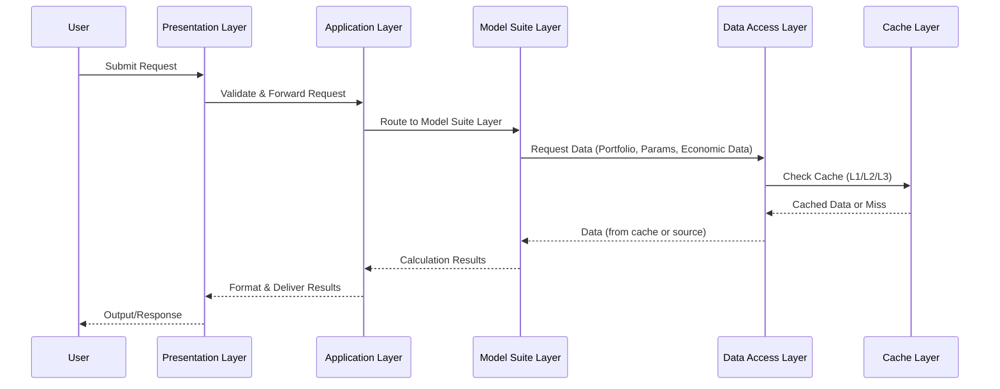

# Table of Contents

- [1. Architectural Principles](#1-architectural-principles)
  - [1.1 Core Principles](#11-core-principles)
- [2. Layer Architecture](#2-layer-architecture)
- [3. Presentation & Application Layers](#3-presentation--application-layers)
  - [3.1 Presentation Layer](#31-presentation-layer)
  - [3.2 Application Layer](#32-application-layer)
- [4. Model Suite Layer (With Domain Logic)](#4-model-suite-layer-with-domain-logic)
  - [4.1 Architecture Components](#41-architecture-components)
  - [4.2 Model-Specific vs. Suite-Specific vs. Common Logic](#42-model-specific-vs-suite-specific-vs-common-logic)
- [5. Data Access Layer](#5-data-access-layer)
  - [5.1 Responsibilities](#51-responsibilities)
  - [5.2 Data Source Abstraction](#52-data-source-abstraction)
  - [5.3 Data Validation at Boundary](#53-data-validation-at-boundary)
- [6. Cache Layer](#6-cache-layer)
  - [6.1 Cache Architecture](#61-cache-architecture)
  - [6.2 Cache Content Types](#62-cache-content-types)
  - [6.3 Cache Invalidation Strategies](#63-cache-invalidation-strategies)
  - [6.4 Cache Coherence](#64-cache-coherence)
- [7. Cross-Layer Interactions](#7-cross-layer-interactions)
- [8. Workflow Orchestration & Suite Dependencies](#8-workflow-orchestration--suite-dependencies)
- [9. Data Access Strategies](#9-data-access-strategies)
- [10. Caching Strategy](#10-caching-strategy)
- [11. Delta Change Handling](#11-delta-change-handling)
- [12. Versioning Strategy](#12-versioning-strategy)
- [13. Design Principles and Trade-offs](#13-design-principles-and-trade-offs)
- [14. Example Request Flows](#14-example-request-flows)

## 1. Architectural Principles
### 1.1 Core Principles
Separation of Concerns

Presentation Layer: User interaction and input validation only
Application Layer: Request routing and output formatting only
Model Suite Layer: All business logic, domain operations, and model execution
Data Access Layer: I/O operations only
Cache Layer: Performance optimization only

Domain Logic Encapsulation

All business rules, calculation workflows, and model orchestration reside within the Model Suite Layer
Request handlers contain zero business logic
Domain operations are either common (shared across suites) or suite-specific

Declarative Dependencies

Suite dependencies are declared in the Suite Registry
Workflow Orchestrator dynamically resolves and executes dependency chains
No hardcoded workflow definitions needed

Data Source Agnosticism

Portfolio data can be embedded in requests or referenced via paths
Application Layer never processes portfolio data
Model Suite Layer handles all data preparation and enrichment

## 2. Layer Architecture
┌─────────────────────────────────────────────┐
│ PRESENTATION LAYER                          │
│ CLI, Config Loader, Input Validation       │
└──────────────────┬──────────────────────────┘
                   │
                   │ Request
                   ▼
┌─────────────────────────────────────────────┐
│ APPLICATION LAYER                           │
│ Request Coordination, Output Handling       │
└──────────────────┬──────────────────────────┘
                   │
                   │ Route to Model Suite Layer
                   ▼
┌─────────────────────────────────────────────┐
│ MODEL SUITE LAYER                           │
│ ┌─────────────────────────────────────┐     │
│ │ Workflow Orchestrator               │     │
│ │ - Dependency resolution             │     │
│ │ - Execution planning                │     │
│ │ - Suite coordination                │     │
│ └─────────────────────────────────────┘     │
│                                             │
│ ┌─────────────────────────────────────┐     │
│ │ Suite Registry & Management         │     │
│ │ - Suite definitions                 │     │
│ │ - Dependency metadata               │     │
│ │ - Input/output contracts            │     │
│ │ - Version management                │     │
│ └─────────────────────────────────────┘     │
│                                             │
│ ┌─────────────────────────────────────┐     │
│ │ Model Suites                        │     │
│ │ - Behavioral Suite                  │     │
│ │ - Pricing Suite                     │     │
│ │ - Cash Flow Suite                   │     │
│ │ - Rate Gen Suite.                   │     │
│ └─────────────────────────────────────┘     │
│                                             │
│ ┌─────────────────────────────────────┐     │
│ │ Common Domain Services              │     │
│ │ - Common Portfolio Enricher         │     │
│ │ - Validation Engine                 │     │
│ │ - Intermediate Result Store         │     │
│ │ - Domain Utilities                  │     │
│ └─────────────────────────────────────┘     │
└──────────────────┬──────────────────────────┘
                   │
                   │ Data Requests
                   ▼
┌─────────────────────────────────────────────┐
│ DATA ACCESS LAYER                           │
│ File I/O, Database Access, API Integration  │
└──────────────────┬──────────────────────────┘
                   │
                   │ Cache Queries
                   ▼
┌─────────────────────────────────────────────┐
│ CACHE LAYER                                 │
│ L1/L2 Cache, Version Registry, Invalidation │
└─────────────────────────────────────────────┘


---

## 3. Presentation & Application Layers

### 3.1 Presentation Layer
The Presentation Layer handles all user-facing interactions without any business logic:

**Responsibilities:**
- Command-line interface and argument parsing
- Configuration file loading and validation
- Input format validation (structure, types, required fields)
- User authentication and authorization
- Request object construction

**Non-Responsibilities:**
- Portfolio data processing
- Business rule validation
- Model selection logic
- Calculation workflows

### 3.2 Application Layer
The Application Layer serves as a thin coordinator between presentation and business logic:

**Responsibilities:**
- Route incoming requests to the Model Suite Layer through request handler
- Coordinate output formatting and delivery
- Manage logging and monitoring at the request level
- Handle top-level error responses
- Orchestrate external system integrations for output delivery

**Critical Design Constraint:**
The Application Layer must NOT contain any:
- Business logic or business rules
- Model selection or compatibility logic
- Portfolio processing or enrichment
- Calculation workflows or orchestration
- Knowledge of suite dependencies

**Request Flow:**
The Application Layer receives a request and immediately delegates to the Model Suite Layer via a simple call, then formats and returns the results.

---

## 4. Model Suite Layer (With Domain Logic)

The Model Suite Layer is the core of the system, containing all business logic, domain operations, and model execution capabilities.

### 4.1 Architecture Components

#### 4.1.1 Workflow Orchestrator
The central coordinator for all suite execution, responsible for:

**Dependency Resolution:**
- Reads suite dependencies from the Suite Registry
- Recursively builds complete dependency graphs
- Performs topological sorting to determine execution order
- Detects and prevents circular dependencies
- Validates that all required inputs can be satisfied

**Execution Planning:**
- Constructs execution directed acyclic graphs (DAGs)
- Identifies opportunities for parallel execution
- Optimizes execution order based on data dependencies
- Plans resource allocation across suite executions

**Portfolio Lifecycle Management:**
- Determines portfolio loading strategy (embedded vs. referenced)
- Delegates to Data Access Layer for portfolio retrieval when needed
- Coordinates common portfolio enrichment via Common Domain Services
- Distributes prepared portfolio to relevant suites

**Inter-Suite Communication:**
- Maps outputs from upstream suites to inputs of downstream suites
- Manages the shared Intermediate Result Store
- Ensures data contracts between suites are satisfied
- Handles result aggregation and consolidation

**Execution Coordination:**
- Executes suites in topologically sorted order
- Manages parallel execution where dependencies allow
- Handles error propagation and rollback strategies
- Provides execution monitoring and progress tracking

#### 4.1.2 Suite Registry & Management
The authoritative source for all suite metadata and relationships:

**Suite Definitions:**
Each suite is registered with comprehensive metadata:
- Suite name and version
- Contained models and their versions
- Execution capabilities and constraints
- Resource requirements and optimization hints

**Dependency Metadata:**
Critical for workflow orchestration:
- Upstream suite dependencies (what must run before this suite)
- Required inputs (what data this suite needs from dependencies)
- Input mapping specifications (how to connect dependency outputs to suite inputs)
- Optional vs. required dependencies

**Input/Output Contracts:**
Formal specifications of suite interfaces:
- Input schema: required fields, types, and validation rules
- Output schema: guaranteed produced fields and their specifications
- Intermediate outputs: results available to dependent suites
- Data format specifications and units

**Version Management:**
- Suite version tracking and compatibility matrices
- Model version dependencies within suites
- Breaking vs. non-breaking change indicators
- Migration paths between versions

**Validation Capabilities:**
- Suite compatibility checking
- Model availability verification
- Version conflict detection
- Dependency satisfaction validation

#### 4.1.3 Individual Model Suites
Each suite encapsulates complete business logic for its domain:

**Behavioral Model Suite:**
- Contains prepayment models, default models, loss severity models
- Orchestrates execution across behavioral models
- Manages behavioral model dependencies and data flows
- Produces prepayment rates, default rates, severity estimates
- Implements behavioral model-specific business rules

**Pricing Model Suite:**
- Contains OAS pricing models, yield calculation models, spread models
- Depends on Behavioral Suite for prepayment and default inputs
- Orchestrates pricing calculations with market data integration
- Produces prices, spreads, yields, durations, convexities
- Implements pricing model-specific business rules

**Cash Flow Suite:**
- Contains cash flow projection models and timing models
- Depends on Behavioral Suite for prepayment and default scenarios
- Projects principal, interest, and loss cash flows
- Produces cash flow vectors, timing distributions, present values
- Implements cash flow model-specific business rules

**...**

**Suite-Level Orchestration:**
Within each suite, the suite orchestrator manages:
- Model execution sequencing within the suite
- Model-specific portfolio processing
- Aggregation of model results
- Application of suite-level business rules
- Result packaging and validation

#### 4.1.4 Common Domain Services
Shared business logic available to all suites:

**Common Portfolio Enricher:**
Performs universal portfolio enrichment needed by all models:
- Standardizes date formats and conventions
- Calculates universal fields (age, remaining term, LTV)
- Applies market data enrichment (rates, curves, indices)
- Performs universal data quality checks
- Handles missing data strategies for common fields

**Validation Engine:**
Enforces business rules across all operations:
- Portfolio data validation (ranges, relationships, business rules)
- Result validation (reasonableness checks, bounds checking)
- Cross-model consistency validation
- Regulatory compliance checks
- Data quality scoring and reporting

**Intermediate Result Store:**
Prevents redundant calculations across suite executions:
- Stores calculated intermediate values with metadata
- Provides lookup capabilities with versioning
- Manages result lifecycle and memory
- Tracks lineage (which suite/model produced each result)
- Ensures consistency of shared calculations

**Domain Utilities:**
Common calculations and transformations:
- Date arithmetic and day count conventions
- Interest rate conversions and compounding
- Statistical calculations and aggregations
- Financial mathematics functions
- Unit conversions and standardizations

### 4.2 Model-Specific vs. Suite-Specific vs. Common Logic

**Common Logic (in Common Domain Services):**
Operations that apply universally across all models and suites:
- Universal field calculations (age, term, etc.)
- Standard date handling
- Basic data quality checks
- Universal market data enrichment

**Suite-Specific Logic (in Suite Orchestrators):**
Business logic specific to a suite's domain but shared across models in that suite:
- Suite-level execution orchestration
- Suite-specific aggregation rules
- Suite-level result validation
- Suite-specific business rule enforcement

**Model-Specific Logic (in Model Processors within Suites):**
Business logic unique to individual models:
- Model-specific portfolio enrichment (prepayment model calculates burnout, default model calculates credit enhancement)
- Model-specific data transformations
- Model-specific feature engineering
- Model-specific calculation procedures

---

## 5. Data Access Layer

The Data Access Layer provides abstraction over all external data sources without any business logic.

### 5.1 Responsibilities

**Portfolio Data Access:**
- File-based portfolio loading (CSV, JSON, Parquet, etc.)
- Database portfolio retrieval (SQL queries, connection management)
- API-based portfolio fetching (REST, GraphQL)
- Streaming data ingestion for real-time portfolios
- Embedded portfolio extraction from request objects

**Model Parameter Access:**
- Model parameter file loading
- Parameter database retrieval
- Version-specific parameter selection
- Parameter validation at the data boundary

**Market Data Access:**
- Interest rate curve retrieval
- Index value fetching
- Volatility surface loading
- Historical data access for calibration

**Reference Data Access:**
- Mortgage pool characteristics
- Issuer information
- Geographic data
- Economic indicators

**Result Persistence:**
- Writing calculation results to files, databases, or APIs
- Audit trail generation
- Archival storage management

### 5.2 Data Source Abstraction

The Data Access Layer provides a unified interface regardless of the underlying source:

**Portfolio Retrieval Strategy:**
The system supports multiple portfolio sourcing methods:
- **Embedded Portfolio:** Portfolio data included directly in the request object (common for API integrations where upstream systems send complete portfolio data)
- **File Reference:** Request includes file path or object store location
- **Database Query:** Request includes query parameters or portfolio identifiers
- **API Endpoint:** Request includes endpoint and authentication for remote retrieval
- **Stream Subscription:** Request includes stream identifier for real-time data

**Source Selection Logic:**
The Data Access Layer examines the request to determine the appropriate strategy:
- If portfolio data is embedded, return it directly
- If a file path is provided, read from the file system or object store
- If database identifiers are provided, execute the query
- If API details are provided, make the external call
- All strategies return the same normalized data structure

**Data Format Handling:**
The layer handles format-specific parsing:
- CSV parsing with configurable delimiters and headers
- JSON/JSON Lines parsing with schema validation
- Parquet columnar format reading with predicate pushdown
- Excel file reading with sheet selection
- XML parsing for legacy system integration
- Binary format handling for proprietary data sources

### 5.3 Data Validation at Boundary

The Data Access Layer performs data boundary validation only:
- Schema compliance (expected fields present, correct types)
- Format validation (dates parseable, numbers well-formed)
- Encoding and character set handling
- Size and sanity limits (file too large, query timeout)

It does NOT perform business validation - that occurs in the Model Suite Layer.

---

## 6. Cache Layer

The Cache Layer provides transparent performance optimization across the system.

### 6.1 Cache Architecture

**Multi-Level Caching:**
The system employs a tiered caching strategy:

**L1 Cache (In-Memory):**
- Fastest access, smallest capacity
- Process-local cache for frequently accessed items within a single request
- Stores recently loaded models, portfolios, and intermediate results
- Lifetime: single request or short time window
- Implementation: process memory, hash maps

**L2 Cache (Shared):**
- Moderate access speed, larger capacity
- Shared across multiple processes or workers
- Stores commonly used models, reference data, market data
- Lifetime: hours to days based on data characteristics
- Implementation: Redis, Memcached, or similar

**L3 Cache (Persistent):**
- Slower access, very large capacity
- Long-term storage of calculation results for audit and replay
- Historical model versions and parameters
- Lifetime: indefinite with explicit invalidation
- Implementation: database or object store

### 6.2 Cache Content Types

**Model Objects:**
- Loaded and initialized models ready for execution
- Cached with version keys for fast retrieval
- Significantly reduces model loading overhead
- Cache key: suite name + model name + version + parameter hash

**Portfolio Data:**
- Processed and enriched portfolio datasets
- Cached after common enrichment phase
- Reusable across multiple suite executions on same portfolio
- Cache key: portfolio identifier + enrichment version hash

**Economic Data:**
- Historical data like HPI, Unemployment
- Interest rate curves, index values, volatility surfaces
- Cache key: data type + effective date + source

**Reference Data:**
- Pool characteristics, issuer data, geographic information
- Long cache lifetime (days to weeks)
- Refreshed when source systems update
- Cache key: data type + entity identifier + version

### 6.3 Cache Invalidation Strategies

**Time-Based Expiration:**
- Each cache entry has a time-to-live (TTL)
- TTL varies by data type (models: long, market data: short)
- Automatic background cleanup of expired entries

**Version-Based Invalidation:**
- New model versions automatically invalidate old cached models
- Parameter changes trigger invalidation of dependent calculations
- Suite version changes cascade to dependent caches

**Dependency-Based Invalidation:**
- Changes to upstream data invalidate downstream caches
- Calculation cache tracks input dependencies
- Invalidation propagates through dependency chains

### 6.4 Cache Coherence

**Consistency Management:**
- Version tags ensure cache coherence across distributed systems
- Optimistic concurrency for cache updates
- Read-through and write-through patterns where appropriate
- Cache warming strategies for predictable access patterns

**Distributed Coordination:**
- Distributed cache maintains consistency across multiple nodes
- Cache invalidation messages broadcast to all nodes
- Eventual consistency acceptable for most cached data

---

## 7. Cross-Layer Interactions

### 7.1 Application → Model Suite Layer
- Application Layer constructs ValuationRequest with either embedded portfolio or data source reference
- Delegates request to Model Suite Layer via single entry point
- Receives consolidated results without understanding internal workflows
- Application Layer has no knowledge of suite dependencies or execution order

### 7.2 Model Suite → Data Access Layer
- Model Suite Layer (via Workflow Orchestrator) delegates all data retrieval
- Workflow Orchestrator examines request to determine portfolio loading strategy
- Data Access Layer returns normalized data regardless of source
- Model Suite Layer never directly accesses files, databases, or APIs

### 7.3 Model Suite → Cache Layer
- All cache operations are transparent to business logic
- Cache lookups occur automatically before expensive operations
- Cache stores occur automatically after calculations
- Suite execution code doesn't contain cache logic

### 7.4 Suite → Suite (via Workflow Orchestrator)
- Suites never directly invoke other suites
- Workflow Orchestrator mediates all inter-suite communication
- Output mapping configured in Suite Registry
- Downstream suites receive required inputs from Intermediate Result Store

---

## 8. Workflow Orchestration & Suite Dependencies

### 8.1 Dependency Declaration in Suite Registry

Each suite declares its dependencies in the Suite Registry as metadata. This creates a declarative dependency system where relationships are explicit and discoverable.

**Dependency Metadata Structure:**
- **Upstream Suite Dependencies:** List of suites that must execute before this suite
- **Required Outputs:** Specific outputs from upstream suites that this suite needs
- **Input Mapping:** How upstream outputs map to this suite's inputs
- **Optional Dependencies:** Dependencies that enhance results but aren't required
- **Execution Constraints:** Requirements for parallel vs. sequential execution

**Example Suite Dependencies:**

*Behavioral Suite:*
- Dependencies: None (leaf node in dependency graph)
- Outputs: prepay_rates, default_rates, loss_severity

*Pricing Suite:*
- Dependencies: Behavioral Suite (required)
- Required Outputs: prepay_rates, default_rates from Behavioral Suite
- Input Mapping: prepay_rates → behavioral_prepay, default_rates → behavioral_default
- Outputs: prices, spreads, yields, durations

*Cash Flow Suite:*
- Dependencies: Behavioral Suite (required)
- Required Outputs: prepay_rates, default_rates, loss_severity from Behavioral Suite
- Input Mapping: all behavioral outputs → cash_flow_inputs
- Outputs: projected_cash_flows, timing_vectors, present_values

### 8.2 Dynamic Workflow Resolution

The Workflow Orchestrator dynamically constructs execution workflows based on registry metadata:

**Dependency Graph Construction:**
When a request specifies one or more target suites:
1. Look up each requested suite in the Registry
2. Retrieve dependency metadata for each suite
3. Recursively resolve dependencies (dependencies of dependencies)
4. Build complete directed acyclic graph (DAG) of all required suites
5. Validate graph for completeness and circular dependency absence

**Execution Order Determination:**
Once the dependency graph is constructed:
1. Perform topological sort on the dependency DAG
2. Identify suites that can execute in parallel (no dependencies between them)
3. Create execution levels where each level can execute concurrently
4. Plan resource allocation across parallel executions
5. Generate optimized execution plan with parallelism annotations

**Example Workflow Resolution:**

*Request: "Execute Pricing Suite"*
- Workflow Orchestrator looks up Pricing Suite
- Discovers dependency on Behavioral Suite
- Looks up Behavioral Suite (no dependencies)
- Execution plan: [Behavioral Suite] → [Pricing Suite]

*Request: "Execute Pricing Suite and Cash Flow Suite"*
- Looks up both target suites
- Both depend on Behavioral Suite
- Deduplicates common dependency
- Execution plan: [Behavioral Suite] → [Pricing Suite, Cash Flow Suite in parallel]

*Request: "Execute Risk Analytics Suite"*
- Looks up Risk Analytics Suite
- Discovers dependencies on Pricing Suite (required) and Cash Flow Suite (optional)
- Looks up Pricing Suite → depends on Behavioral Suite
- Looks up Cash Flow Suite → depends on Behavioral Suite
- Execution plan: [Behavioral Suite] → [Pricing Suite, Cash Flow Suite in parallel] → [Risk Analytics Suite]

### 8.3 Workflow Execution

**Portfolio Lifecycle Management:**
The Workflow Orchestrator manages the complete portfolio lifecycle:

1. **Portfolio Acquisition:**
   - Examine request to determine portfolio source (embedded vs. referenced)
   - If embedded: extract portfolio directly from request
   - If referenced: delegate to Data Access Layer for retrieval
   - Validate portfolio structure at data boundary

2. **Common Enrichment:**
   - Apply Common Portfolio Enricher (from Common Domain Services)
   - Calculate universal fields needed by all models
   - Perform universal data quality checks
   - Store enriched portfolio for suite distribution

3. **Distribution to Suites:**
   - Provide enriched portfolio to each suite in execution order
   - Suites perform additional suite-specific or model-specific enrichment
   - Portfolio object may be shared (immutable) or copied depending on suite needs

**Inter-Suite Data Flow:**
The Workflow Orchestrator manages data passing between suites:

1. **Output Capture:**
   - As each suite completes, capture its outputs in the Intermediate Result Store
   - Tag outputs with suite name, version, and execution metadata
   - Validate that promised outputs (per suite contract) were produced

2. **Input Mapping:**
   - Before executing downstream suite, retrieve Input Mapping from Suite Registry
   - For each required input, fetch corresponding output from Intermediate Result Store
   - Validate that all required inputs are available
   - Map outputs to inputs according to registry specifications

3. **Result Aggregation:**
   - Accumulate results from all executed suites
   - Maintain lineage information (which suite produced which results)
   - Provide consolidated result object to Application Layer

**Parallel Execution Management:**
When multiple suites can execute in parallel:
- Allocate resources (threads, processes, or distributed workers)
- Execute suites concurrently within same execution level
- Synchronize completion before proceeding to next level
- Handle partial failures (decision: fail entire workflow or continue with available results)

### 8.4 Dependency Validation

The Suite Registry and Workflow Orchestrator enforce several validation rules:

**At Registration Time:**
When a suite is registered:
- Verify all declared dependencies exist in registry
- Check for circular dependencies across all suites
- Validate that input mappings reference valid outputs
- Ensure version compatibility with dependencies

**At Request Time:**
When a workflow is requested:
- Verify requested suites exist and are available
- Confirm all suite dependencies can be satisfied
- Check that version combinations are compatible
- Validate that required models within suites are available

**At Execution Time:**
During workflow execution:
- Verify that each suite produces its declared outputs
- Validate that outputs meet schema expectations
- Check that required inputs are present before invoking downstream suites
- Monitor for runtime failures and propagate appropriately

---

## 9. Data Access Strategies

### 9.1 Portfolio Loading Strategies

The system supports multiple portfolio sourcing patterns, all transparent to the Model Suite Layer:

**Embedded Portfolio:**
- Portfolio data included in the Request object as a string or binary format
- Common pattern for API integrations and real-time requests
- Upstream systems serialize portfolio and include in request
- Advantages: No I/O latency, guaranteed data availability
- Considerations: Request size limits, serialization overhead

**File-Based Reference:**
- Request includes file path (local filesystem or object store URL)
- Common for batch processing and large portfolios
- Data Access Layer handles file reading and parsing
- Advantages: Handles large datasets, efficient for repeated access
- Considerations: File system availability, permission management

**Hybrid Strategy:**
- Request includes metadata about portfolio (ID, version, hash)
- Data Access Layer attempts cache lookup first
- On cache miss, retrieves from appropriate source
- Advantages: Performance optimization, flexibility
- Considerations: Cache consistency management

### 9.2 Data Loading Optimization

**Lazy Loading:**
- Portfolio data loaded only when required by suite execution
- If multiple suites process same portfolio, load once and share
- Reduces memory footprint for large batch operations

**Incremental Loading:**
- For very large portfolios, load in chunks or partitions
- Suites process partitions independently
- Results aggregated across partitions
- Enables processing of portfolios larger than memory

**Parallel Async Loading:**
- When multiple data sources needed (portfolio + market data + reference data)
- Data Access Layer loads in parallel
- Synchronizes before passing to Model Suite Layer

### 9.3 Data Format Handling

**Schema Evolution:**
- Data Access Layer handles multiple portfolio schema versions
- Automatically upgrades older schemas to current format
- Schema version tracked in metadata
- Model Suite Layer always receives current schema format

**Type Coercion:**
- Data Access Layer performs safe type conversions
- Handles missing values according to configurable strategies
- Standardizes numeric representations (decimals, floats)
- Normalizes date formats to internal standard

**Data Quality Checks:**
- Boundary validation performed by Data Access Layer
- Business validation delegated to Model Suite Layer
- Data quality metrics captured and reported
- Configurable handling of quality issues (fail, warn, impute)

---

## 10. Caching Strategy

### 10.1 Cache Key Design

Effective caching depends on well-designed cache keys that uniquely identify cached content:

**Model Cache Keys:**
- Components: suite_name + model_name + model_version + parameter_file_hash
- Example: "BehavioralSuite_PrepayModel_v2.1_abc123def456"
- Ensures different parameter versions cached separately
- Enables parallel access to multiple model versions

**Portfolio Cache Keys:**
- Components: portfolio_identifier + enrichment_version + hash_of_content
- Example: "portfolio_2024Q4_v1.2_789xyz"
- Content hash prevents cache collisions for different portfolios with same ID
- Enrichment version ensures cache invalidation when enrichment logic changes

**Intermediate Result Cache Keys:**
- Components: calculation_type + input_hash + model_version + suite_version
- Example: "seasonal_factors_abc123_prepay_v2.1_behavioral_v3.0"
- Input hash ensures different inputs don't collide
- Model and suite versions track calculation provenance

**Economic Data Cache Keys:**
- Components: data_type + effective_date + source + curve_type
- Example: "yield_curve_2024-11-02_treasury_zero_coupon"
- Date precision matches data update frequency
- Source identifier allows multiple data providers

### 10.2 Cache Coherence in Distributed Systems

**Distributed Cache Coordination:**
- Multiple compute nodes share L2 cache layer
- Cache updates broadcast to all nodes via pub/sub
- Optimistic consistency sufficient for most use cases
- Critical data (like prices) may use stronger consistency

**Version Synchronization:**
- All nodes use same Suite Registry version
- Model version updates coordinated across cluster
- Parameter changes propagate to all caches
- Ensures consistent results across distributed execution

**Cache Hierarchy Navigation:**
- L1 (local) checked first, fastest access
- L2 (shared) checked on L1 miss, moderate speed
- L3 (persistent) checked on L2 miss, slower but comprehensive
- Source system accessed only on complete cache miss

---

11. Delta Change Handling (Comprehensive)
11.1 Change Dimensions
The system must handle changes across multiple dimensions:
1. Portfolio Changes

Security characteristics modified (balances, coupons, etc.)
Securities added or removed
Pool characteristics updated

2. Economic/Market Data Changes

Interest rate forecasts (Primary Rate, Treasury curves)
House Price Index (HPI) forecasts
Macroeconomic indicators (unemployment, GDP growth, inflation)
Market spreads and volatilities
Index values (LIBOR, SOFR, etc.)

3. Model Changes

Model version switches (CFPM_1 → CFPM_2)
Model parameter recalibration
Model methodology updates

4. Configuration Changes

Scenario assumptions (stress scenarios)
Run parameters (calculation date, horizon)
Output requirements

Each change dimension requires different delta detection strategies and has different implications for what must be recalculated.

11.2 Multi-Dimensional Change Detection
11.2.1 Portfolio Change Detection
Detection Methods:

Hash-based comparison of portfolio segments
Timestamp tracking for last modification
Explicit change markers from upstream systems
Version numbers for portfolio datasets

Granularity:

Portfolio level: Entire portfolio changed
Segment level: Cohorts, issuers, or tranches changed
Security level: Individual securities modified
Field level: Specific attributes changed

Change Types:

Additions: New securities added to portfolio
Deletions: Securities removed from portfolio
Modifications: Existing security characteristics changed
Rebalancing: Factor changes (balances) without characteristic changes

11.2.2 Economic Data Change Detection
Detection Methods:
Curve Comparison:

Compare current vs. previous interest rate curves point-by-point
Track curve shape changes (parallel shifts, twists, butterflies)
Identify material vs. immaterial changes (threshold-based)

Forecast Comparison:

Compare HPI forecasts path by path
Identify forecast revision dates and magnitudes
Track which forecast components changed

Change Significance Assessment:
Economic Data Change Impact Assessment:

IF rate_change < 5 basis points AND curve_shape_similar:
    impact = "immaterial"  # May not require recalculation

ELSE IF rate_change < 25 basis points:
    impact = "moderate"  # Selective recalculation

ELSE:
    impact = "material"  # Full recalculation required
```

**Tracking Metadata:**
```
EconomicDataVersion:
  effective_date: 2024-11-02
  data_type: "primary_rate_forecast"
  source: "Federal_Reserve"
  version_hash: "abc123def456"
  
  previous_version:
    effective_date: 2024-10-02
    version_hash: "xyz789uvw012"
  
  changes:
    - type: "rate_path"
      magnitude: "+15 basis points"
      affected_periods: ["2025-Q1", "2025-Q2"]
```

#### 11.2.3 Model Change Detection

**Change Types:**

**Model Version Changes:**
- Major version: Methodology change, breaking changes
- Minor version: Parameter recalibration, non-breaking changes
- Patch version: Bug fixes, no calculation impact

**Detection Strategy:**
```
ModelChangeType:
  
  CFPM_1 (v2.1.3) → CFPM_2 (v3.0.0):
    change_type: "major_version"
    impact: "full_recalculation"
    backward_compatible: false
    reason: "New prepayment methodology"
  
  CFPM_2 (v3.0.0) → CFPM_2 (v3.1.0):
    change_type: "minor_version"  
    impact: "selective_recalculation"
    backward_compatible: true
    reason: "Updated coefficients from recent data"
  
  CFPM_2 (v3.1.0) → CFPM_2 (v3.1.1):
    change_type: "patch"
    impact: "none"  # Results identical
    backward_compatible: true
    reason: "Code refactoring, no calculation changes"
```

**Model Compatibility Matrix:**
```
Suite Registry tracks model change impacts:

BehavioralSuite:
  PrepaymentModel:
    v2.1 → v2.2:
      requires_recalculation: false  # Same results
      cache_compatible: true
    
    v2.x → v3.0:
      requires_recalculation: true  # Different methodology
      cache_compatible: false
      invalidates_downstream: [PricingSuite, CashFlowSuite]
```

#### 11.2.4 Configuration Change Detection

**Parameter Comparison:**
```
ConfigurationDiff:
  
  Previous Run:
    effective_date: 2024-11-01
    scenario: "base"
    output_detail: "summary"
  
  Current Run:
    effective_date: 2024-11-02  # Changed
    scenario: "base"
    output_detail: "detailed"  # Changed
  
  Impact Assessment:
    effective_date_change:
      impact: "full_recalculation"  # Time-dependent calculations affected
      
    output_detail_change:
      impact: "none"  # Calculation logic unchanged, only output format
```

---

### 11.3 Unified Change Management Framework

#### 11.3.1 Change Vector Concept

Every request carries a **Change Vector** that captures all change dimensions:
```
ChangeVector:
  request_id: "req_20241102_123456"
  
  portfolio_changes:
    change_type: "delta"
    changed_securities: ["CUSIP123", "CUSIP456"]  # 2 out of 1000
    change_percentage: 0.2%
    portfolio_version: "2024-11-02-v3"
    previous_version: "2024-11-01-v2"
  
  economic_data_changes:
    primary_rate_forecast:
      changed: true
      magnitude: "+15 bps"
      change_type: "material"
      version: "2024-11-02"
      previous_version: "2024-11-01"
    
    hpi_forecast:
      changed: true
      magnitude: "-2% cumulative"
      change_type: "moderate"
      version: "2024-11-02"
      previous_version: "2024-10-01"
    
    treasury_curve:
      changed: false
      version: "2024-11-01"  # Unchanged
  
  model_changes:
    behavioral_suite:
      prepayment_model:
        changed: true
        previous_version: "CFPM_1_v2.1"
        current_version: "CFPM_2_v3.0"
        change_impact: "major"
        requires_recalculation: true
      
      default_model:
        changed: false
        current_version: "CDM_v1.5"
  
  configuration_changes:
    effective_date:
      changed: true
      previous: "2024-11-01"
      current: "2024-11-02"
    
    scenario:
      changed: false
      value: "base"
```

#### 11.3.2 Change Impact Analysis

The Workflow Orchestrator performs comprehensive impact analysis:
```
Change Impact Analysis Process:

1. Receive ValuationRequest with Change Vector

2. Analyze Portfolio Changes:
   - Identify changed securities (0.2% of portfolio)
   - Determine if changed securities affect calculated aggregates
   
3. Analyze Economic Data Changes:
   - Primary rate +15 bps → Material impact on prepayment
   - HPI -2% → Moderate impact on default, loss severity
   - Treasury curve unchanged → No impact on discounting
   
4. Analyze Model Changes:
   - CFPM_1 → CFPM_2 → Full recalculation required for prepayment
   - Model change invalidates all previous prepayment results
   - Downstream dependencies: Pricing, Cash Flow require recalc
   
5. Determine Overall Recalculation Scope:
   
   IF model_change_requires_full_recalc:
       scope = "full"  # Model change forces full recalc
   
   ELSE IF economic_data_change_material:
       scope = "full"  # Material economic change forces full recalc
   
   ELSE IF portfolio_change_percentage < 5% AND economic_data_change_moderate:
       scope = "delta"  # Can use incremental approach
   
   ELSE:
       scope = "full"  # Default to full for safety

6. Identify Reusable Cached Results:
   - Treasury curve unchanged → Discount factors reusable
   - 99.8% of portfolio unchanged → Check cache for those securities
   - BUT: Model change invalidates all prepayment cache
   - RESULT: Can reuse discount factors only
```

---

### 11.4 Cache Invalidation Strategies by Change Type

#### 11.4.1 Portfolio Change Invalidation

**Granular Invalidation:**
```
Portfolio Change: 20 securities modified out of 10,000

Cache Invalidation:
  - Invalidate common enrichment cache for changed securities only
  - Invalidate model results for changed securities only
  - Keep cached results for 9,980 unchanged securities
  - Recompute aggregates if changed securities material to totals

Cache Keys Affected:
  - portfolio_enriched:{portfolio_version}  # Version change invalidates
  - model_results:{model}:{security_id}:*  # Per-security results
  - aggregates:*  # May need recomputation
```

#### 11.4.2 Economic Data Change Invalidation

**Cascade Invalidation:**
```
Economic Data Change: Primary Rate forecast revised +15 bps

Impact Assessment:
  1. Which models use Primary Rate forecast?
     - Prepayment models: YES (direct input)
     - Default models: YES (indirect via affordability)
     - Pricing models: YES (discount rates)
  
  2. Invalidation cascade:
     - Invalidate ALL prepayment results (uses rates directly)
     - Invalidate ALL default results (indirect dependency)
     - Invalidate ALL pricing results (discount rate changed)
     - Invalidate ALL cash flow projections (dependent on prepay/default)

Result: Economic data change typically requires full recalculation

Exception Handling:
  IF rate_change < materiality_threshold (5 bps):
     Option 1: No invalidation, within tolerance
     Option 2: Flag results as "stale but within tolerance"
     Option 3: Background refresh for future requests
```

**Version-Based Invalidation:**
```
Cache Key Structure with Economic Data Versions:

Old cache keys:
  prepay_results:{portfolio_hash}:{model_version}
  
Problem: Doesn't capture economic data dependency

New cache keys:
  prepay_results:{portfolio_hash}:{model_version}:{econ_data_version}
  
Where econ_data_version includes:
  - Primary rate forecast hash
  - HPI forecast hash
  - Other relevant economic input hashes

Benefit: Automatic invalidation when economic data changes
```

#### 11.4.3 Model Change Invalidation

**Version-Based Automatic Invalidation:**
```
Model Change: CFPM_1 v2.1 → CFPM_2 v3.0

Cache Key Structure:
  prepay_results:{portfolio}:{CFPM_1_v2.1}:{econ_data_v1}  # Old
  prepay_results:{portfolio}:{CFPM_2_v3.0}:{econ_data_v1}  # New

Result: Different cache keys → automatic "invalidation"
  - Old results remain in cache (for backwards queries)
  - New model version creates new cache entries
  - No explicit invalidation needed
  - Cache naturally expires old versions via LRU

Downstream Invalidation:
  - Pricing suite depends on prepayment results
  - Pricing cache keys include prepayment model version
  - pricing_results:{portfolio}:{pricing_model}:{CFPM_1_v2.1}  # Old
  - pricing_results:{portfolio}:{pricing_model}:{CFPM_2_v3.0}  # New
  - Automatic downstream invalidation via version tracking
```

**Breaking vs. Non-Breaking Changes:**
```
Minor Version Update: CFPM_2 v3.0 → v3.1 (recalibration)

If backward_compatible = true AND results_substantially_similar:
  Option 1: Allow cache reuse with version upgrade flag
    - Retrieve v3.0 results
    - Flag as "calculated with previous version"
    - User decides: accept or force recalculation
  
  Option 2: Automatic cache invalidation
    - Treat like major version change
    - Force recalculation for accuracy

Policy Configuration:
  cache_policy:
    minor_version_changes:
      allow_reuse: false  # Conservative: always recalculate
      # OR
      allow_reuse: true   # Performance: accept version staleness
      stale_warning: true
```

#### 11.4.4 Configuration Change Invalidation

**Selective Invalidation:**
```
Configuration Change Analysis:

Change: effective_date: 2024-11-01 → 2024-11-02

Impact:
  - All time-dependent calculations affected
  - Portfolio age, remaining term change
  - Economic data point shifts
  - Full recalculation required

Cache Invalidation: ALL


Change: output_detail: "summary" → "detailed"

Impact:
  - Calculation logic unchanged
  - Only output formatting affected
  - NO recalculation needed

Cache Invalidation: NONE


Change: scenario: "base" → "stress"

Impact:
  - Economic assumptions change
  - Treated like economic data change
  - Full recalculation required

Cache Invalidation: ALL
```

---

### 11.5 Delta Processing Workflows

#### 11.5.1 Pure Portfolio Delta

**Scenario:**
- Portfolio: 0.5% changed (50 out of 10,000 securities)
- Economic data: Unchanged
- Models: Same versions
- Configuration: Same

**Workflow:**
```
1. Change Detection:
   - Compare portfolio hashes: changed
   - Compare economic data versions: unchanged
   - Compare model versions: unchanged

2. Impact Analysis:
   - Only portfolio changed
   - Scope: Delta processing eligible

3. Cache Strategy:
   - Check cache for 9,950 unchanged securities
   - Cache hit: Retrieve previous results
   - Cache miss or changed: Calculate

4. Processing:
   - Common enrichment: Apply to 50 changed securities only
   - Model execution:
     * Load cached results for 9,950 securities
     * Execute models on 50 changed securities
   - Aggregate: Merge cached + new results

5. Result:
   - Full portfolio results with mixed fresh/cached data
   - Metadata indicates delta processing used
   - Processing time: ~5% of full run
```

#### 11.5.2 Economic Data Change Only

**Scenario:**
- Portfolio: Unchanged
- Economic data: Primary rate forecast revised +20 bps
- Models: Same versions
- Configuration: Same

**Workflow:**
```
1. Change Detection:
   - Portfolio hash: unchanged
   - Economic data version: changed (material)
   - Model versions: unchanged

2. Impact Analysis:
   - Economic data change affects all models
   - Models use interest rates as inputs
   - Scope: Full recalculation required

3. Cache Strategy:
   - Portfolio enrichment: Reusable (only econ data changed)
   - Model results: Cannot reuse (econ dependency)
   - Strategy: Reuse enrichment, recalculate models

4. Processing:
   - Common enrichment: Retrieve from cache (portfolio unchanged)
   - Load new economic data (revised forecasts)
   - Execute all models on full portfolio with new data
   - Generate fresh results

5. Result:
   - Full portfolio results, all fresh
   - Processing time: ~60% of full run (saved enrichment time)
```

#### 11.5.3 Model Version Change

**Scenario:**
- Portfolio: Unchanged
- Economic data: Unchanged
- Models: CFPM_1 v2.1 → CFPM_2 v3.0 (major version)
- Configuration: Same

**Workflow:**
```
1. Change Detection:
   - Portfolio hash: unchanged
   - Economic data version: unchanged
   - Model version: changed (major)

2. Impact Analysis:
   - Major model version = methodology change
   - Results not comparable to previous version
   - Downstream dependencies invalidated
   - Scope: Full recalculation required

3. Cache Strategy:
   - Portfolio enrichment: Reusable (unchanged)
   - Previous model results: Not reusable (incompatible version)
   - Downstream results: Not reusable (dependency changed)
   - Strategy: Reuse enrichment only

4. Processing:
   - Common enrichment: Retrieve from cache
   - Load new model version CFPM_2 v3.0
   - Execute new model on full portfolio
   - Execute downstream suites (Pricing, Cash Flow) with new inputs
   - Generate fresh results

5. Result:
   - Full portfolio results with new model
   - Side-by-side comparison with v2.1 available if requested
   - Processing time: ~70% of full run (saved enrichment, but new model may have different performance)
```

#### 11.5.4 Combined Changes (Most Complex)

**Scenario:**
- Portfolio: 1% changed
- Economic data: HPI forecast revised -3% (material)
- Models: Default model v1.5 → v1.6 (minor, recalibration)
- Configuration: Same

**Workflow:**
```
1. Change Detection:
   - Portfolio: delta
   - Economic data: changed (material)
   - Model: changed (minor)

2. Impact Analysis:
   - HPI affects default and loss severity models
   - Default model version changed (minor, compatible)
   - Portfolio changes small
   - Decision: Economic data change dominates → full recalculation

3. Cache Strategy:
   - Portfolio enrichment: Partial reuse (99% unchanged)
   - Model results: Cannot reuse (econ data + model version changed)
   - Strategy: Partial enrichment reuse, full model execution

4. Processing:
   - Common enrichment:
     * Retrieve cached for 99% unchanged
     * Apply to 1% changed
   - Load new economic data (HPI forecasts)
   - Load new default model v1.6
   - Execute all models on full portfolio (new econ + new model)
   - Generate fresh results

5. Result:
   - Full portfolio results
   - Processing time: ~65% of full run
   - Metadata indicates multiple change dimensions
```

---

### 11.6 Change Tracking and Audit

#### 11.6.1 Change History Logging

**Change Log Structure:**
```
ChangeLog:
  request_id: "req_20241102_123456"
  execution_timestamp: "2024-11-02T10:30:00Z"
  
  changes_detected:
    - dimension: "portfolio"
      change_type: "delta"
      magnitude: "0.5% securities modified"
      
    - dimension: "economic_data"
      data_type: "primary_rate_forecast"
      change_type: "material"
      magnitude: "+15 bps"
      
    - dimension: "model"
      suite: "BehavioralSuite"
      model: "PrepaymentModel"
      change_type: "major_version"
      old_version: "CFPM_1_v2.1"
      new_version: "CFPM_2_v3.0"
  
  impact_assessment:
    recalculation_scope: "full"
    reason: "Model major version change"
    cache_reuse:
      enrichment: "partial"
      model_results: "none"
      
  processing_strategy:
    type: "full_recalculation"
    optimization: "reuse_enrichment_partial"
    
  execution_metrics:
    total_time_seconds: 45.2
    enrichment_time_seconds: 2.1
    model_execution_time_seconds: 38.5
    aggregation_time_seconds: 4.6
    
  cache_statistics:
    enrichment_cache_hits: 9950
    enrichment_cache_misses: 50
    model_cache_hits: 0  # Version change
    model_cache_misses: 10000
```

#### 11.6.2 Result Version Tracking

**Result Metadata:**
```
CalculationResult:
  result_id: "result_20241102_123456"
  request_id: "req_20241102_123456"
  
  inputs_fingerprint:
    portfolio_version: "2024-11-02-v3"
    portfolio_hash: "abc123..."
    
    economic_data_versions:
      primary_rate: "2024-11-02"
      hpi_forecast: "2024-11-02"
      treasury_curve: "2024-11-01"
      
    model_versions:
      BehavioralSuite.PrepaymentModel: "CFPM_2_v3.0"
      BehavioralSuite.DefaultModel: "CDM_v1.5"
      PricingSuite.OAS_Pricing: "OAS_v2.1"
      
    configuration:
      effective_date: "2024-11-02"
      scenario: "base"
  
  processing_metadata:
    execution_type: "full_recalculation"
    cache_usage:
      enrichment_cache_rate: 99.5%
      model_cache_rate: 0%
    
  lineage:
    depends_on: []  # Fresh calculation
    invalidates: ["result_20241101_789012"]  # Made this obsolete
```

---

### 11.7 Change Management Policies

#### 11.7.1 Materiality Thresholds

**System Configuration:**
```
materiality_thresholds:
  
  economic_data:
    interest_rates:
      immaterial: 5_bps  # No action
      moderate: 25_bps   # Flag, optional recalc
      material: 50_bps   # Force recalc
      
    hpi_forecast:
      immaterial: 0.5%   # Cumulative change
      moderate: 2%
      material: 5%
      
    spreads:
      immaterial: 10_bps
      moderate: 25_bps
      material: 50_bps
  
  portfolio:
    security_count_change:
      immaterial: 0.1%
      moderate: 1%
      material: 5%
      
    balance_change:
      immaterial: 0.5%
      moderate: 2%
      material: 10%
  
  actions_by_materiality:
    immaterial:
      recalculation: optional
      cache_reuse: allowed
      warning: none
      
    moderate:
      recalculation: recommended
      cache_reuse: allowed_with_warning
      warning: "Results may differ due to input changes"
      
    material:
      recalculation: required
      cache_reuse: not_allowed
      warning: "Significant input changes detected"
```

#### 11.7.2 Cache Staleness Policies

**Staleness Tolerance:**
```
cache_staleness_policy:
  
  # How old can cached results be?
  max_age:
    portfolio_enrichment: 7_days
    model_results: 1_day
    aggregates: 1_day
  
  # Version staleness tolerance
  version_staleness:
    model_minor_version:
      allow_use: true
      max_versions_behind: 2
      warning: "Calculated with previous model version"
      
    model_major_version:
      allow_use: false
      
    economic_data:
      allow_use: true
      max_age_days: 1
      warning: "Calculated with previous day's data"
  
  # User override options
  user_controls:
    allow_stale_results: configurable
    force_fresh_calculation: always_available
```

---

### 11.8 Performance Optimization Strategies

#### 11.8.1 Selective Recalculation

**Smart Dependency Tracking:**
```
Model Dependency Graph:

Primary Rate Change:
  Direct Impact:
    - PrepaymentModel (uses rates for refinancing incentive)
  
  Indirect Impact:
    - PricingModel (depends on PrepaymentModel outputs)
    - CashFlowModel (depends on PrepaymentModel outputs)
  
  No Impact:
    - LossSeVerityModel (doesn't use interest rates)
  
Optimization:
  - Recalculate PrepaymentModel
  - Recalculate dependent models (Pricing, CashFlow)
  - Skip LossSeverityModel (no dependency)
  - Save ~15% execution time

HPI Change:
  Direct Impact:
    - DefaultModel (uses HPI for LTV updates)
    - LossSeverityModel (uses HPI for loss calculations)
  
  Indirect Impact:
    - PricingModel (depends on Default outputs)
    - CashFlowModel (depends on Default outputs)
  
  No Impact:
    - PrepaymentModel (doesn't use HPI in this implementation)
  
Optimization:
  - Recalculate Default and LossSeverity
  - Recalculate dependent models
  - Skip PrepaymentModel if not dependent
```

#### 11.8.2 Incremental Economic Data Updates

**Curve Delta Application:**
```
Treasury Curve Update: Small parallel shift +5 bps

Instead of full recalculation:

1. Retrieve cached discount factors
2. Apply adjustment: DF_new = DF_old × exp(-0.0005 × t)
3. Recalculate only discount-dependent values
4. Keep model outputs unchanged

Savings: ~80% execution time for pricing calculations

Applicability:
  - Small, parallel curve shifts
  - Linear relationships to rates
  - Within materiality thresholds
  
Not applicable:
  - Nonlinear models (prepayment S-curves)
  - Material rate changes
  - Curve shape changes (twists, butterflies)
```

---

### 11.9 Change Notification and Transparency

#### 11.9.1 User Notification

**Change Summary in Results:**
```
ValuationResult:
  status: "success"
  
  change_summary:
    changes_since_last_run:
      - type: "economic_data"
        description: "Primary rate forecast revised +15 bps"
        materiality: "material"
        
      - type: "portfolio"
        description: "50 securities modified (0.5%)"
        materiality: "immaterial"
    
    recalculation_scope: "full"
    reason: "Material economic data change"
    
    cache_utilization:
      enrichment: "99.5% from cache"
      models: "0% from cache (full recalculation)"
      
    version_information:
      models_used:
        - "CFPM_2_v3.0 (upgraded from v2.1)"
        - "CDM_v1.5 (unchanged)"
      economic_data_as_of: "2024-11-02"
      
  warnings:
    - "Results not comparable to previous run due to model upgrade"
    - "Material interest rate forecast change applied"
```

#### 11.9.2 Comparison Capabilities

**Side-by-Side Analysis:**
```
Request: "Compare current results with previous run"

System provides:
  - Identified changes between runs
  - Results from both runs
  - Difference analysis
  - Attribution: how much of difference due to each change dimension

Example Output:
  Total prepayment rate difference: +0.15%
  
  Attribution:
    - Portfolio changes: +0.01%
    - Rate forecast change: +0.12%
    - Model version change: +0.02%
    
  Interpretation: Most difference due to rate forecast revision

---

## 12. Versioning Strategy

### 12.1 Multi-Level Versioning

The system employs versioning at multiple levels to ensure reproducibility and auditability:

**Model Versions:**
- Each model has semantic version (major.minor.patch)
- Version changes tracked with change type (bug fix, enhancement, breaking change)
- Multiple versions can coexist in same system
- Requests can specify required model version or use "latest stable"

**Suite Versions:**
- Suites versioned independently from constituent models
- Suite version increments when:
  - Model composition changes (model added/removed)
  - Model versions updated within suite
  - Suite-level orchestration logic changes
  - Suite dependencies change
- Suite version captures complete calculation configuration

**Parameter Versions:**
- Model parameters versioned separately from model code
- Parameters may be recalibrated without code changes
- Each parameter set has version and effective date
- System can load historical parameter versions for backtesting

**Schema Versions:**
- Portfolio schema versioned to handle evolving data structures
- Input/output schemas for suites versioned
- Backward compatibility maintained across minor versions
- Major version changes require explicit migration

**System Versions:**
- Overall system version encapsulates all component versions
- Useful for enterprise deployment and rollback
- System version tied to release schedule
- All component versions documented in release notes

### 12.2 Version Compatibility Management

**Compatibility Matrix:**
The Suite Registry maintains compatibility information:
- Which model versions are compatible with which suite versions
- Which suite versions can coexist in a workflow
- Breaking vs. non-breaking changes documented
- Deprecated version warnings

**Version Selection Logic:**
When executing a workflow:
- If user specifies exact versions, system uses those
- If user specifies version constraints (e.g., ">=2.0, <3.0"), system selects compatible version
- If user doesn't specify, system uses current production versions
- System validates compatibility before execution

**Dependency Version Coordination:**
- When Pricing Suite depends on Behavioral Suite, version compatibility checked
- If versions incompatible, error raised before execution
- Workflow Orchestrator can suggest compatible version combinations
- Allows gradual rollout of new versions

### 12.3 Version-Based Caching

**Cache Keys Include Versions:**
- All cache keys include relevant version information
- Different versions cached separately to avoid conflicts
- Enables safe testing of new versions without cache pollution

**Version-Based Invalidation:**
- New model version release doesn't invalidate caches of old versions
- Allows parallel operation of multiple versions
- Gradual migration path for users

**Result Reproducibility:**
- Given identical:
  - Portfolio (including version/hash)
  - Model versions
  - Parameter versions
  - Suite versions
  - Effective date (for market data)
- System produces identical results (deterministic execution)
- Critical for regulatory compliance and debugging

### 12.4 Version Migration

**Automatic Migration:**
- System can automatically migrate between compatible versions
- Minor version updates: transparent to users
- Patch version updates: automatic with notifications

**Manual Migration:**
- Major version changes require explicit user action
- Migration utilities provided for portfolio schema changes
- Side-by-side comparison tools for version differences

**Deprecation Policy:**
- Old versions marked deprecated with sunset date
- Warning messages when deprecated versions used
- Gradual phase-out with migration support
- Minimum support period for regulatory compliance

---

## 13. Design Principles and Trade-offs

### 13.1 Principles

**1. Encapsulation**
Each model suite encapsulates its complete business logic and calculation orchestration. External layers interact with suites only through defined interfaces.

**2. Single Source of Truth**
Suite Registry is authoritative for all suite metadata, dependencies, and contracts. No duplicate configuration exists elsewhere in the system.

**3. Separation of Concerns**
- Presentation: User interaction
- Application: Request routing
- Model Suite: Business logic
- Data Access: I/O operations
- Cache: Performance optimization

Each layer has clear, non-overlapping responsibilities.

**4. Declarative Configuration**
Dependencies, workflows, and relationships declared in metadata rather than hardcoded. Enables dynamic behavior without code changes.

**5. Extensibility**
New suites, models, and workflows added through configuration and plugin-like extension. Core system remains stable.

**6. Performance Through Caching**
Aggressive caching at multiple levels with intelligent invalidation. Performance optimization is transparent to business logic.

**7. Reproducibility**
Comprehensive versioning and audit trails ensure identical inputs produce identical outputs. Critical for regulatory compliance.

### 13.2 Trade-offs

**Pros:**

**Tight Encapsulation:**
- Business logic localized within suites
- Changes to suite logic don't affect other layers
- Clear ownership and responsibility boundaries

**Plugin Architecture:**
- Suites can be developed, versioned, and deployed independently
- Third-party suites can be integrated
- Easier to distribute as separate packages or services

**Simplified Versioning:**
- Suite version encompasses all constituent logic
- Clear version compatibility checking
- Easier to reason about calculation reproducibility

**Dynamic Workflows:**
- No hardcoded workflow definitions
- Supports arbitrary suite combinations
- Automatic dependency resolution reduces errors

**Cons:**

**Potential Code Duplication:**
- Similar operations across suites may be duplicated
- Mitigation: Common Domain Services for truly universal operations
- Trade-off accepted for stronger encapsulation

**Cross-Suite Reuse Complexity:**
- Sharing business logic between suites requires careful design
- Options: Common Domain Services, or accept duplication for suite-specific variants
- Balance between DRY principle and encapsulation

**Testing Complexity:**
- Testing business logic requires suite context
- Unit testing at model processor level provides some isolation
- Integration testing essential for workflow validation

**Coordination Overhead:**
- Workflow Orchestrator adds execution overhead
- Multi-suite workflows incur coordination costs
- Mitigated by parallel execution and caching

---

## 14. Example Request Flows

### 14.1 Simple Request: Behavioral Suite Only

**Request:**
User submits request: "Execute Behavioral Suite on embedded portfolio with prepayment and default models"

**Flow:**
1. Presentation Layer validates request structure, constructs ValuationRequest object with embedded portfolio
2. Application Layer routes request to Model Suite Layer
3. Workflow Orchestrator:
   - Looks up Behavioral Suite in Registry
   - Discovers no dependencies
   - Determines execution plan: [Behavioral Suite]
   - Extracts embedded portfolio from request
   - Invokes Common Portfolio Enricher (universal field calculations)
4. Behavioral Suite:
   - Receives enriched portfolio
   - Performs suite-specific enrichment
   - Executes prepayment model (model-specific processing, then calculation)
   - Stores prepayment results and intermediate values
   - Executes default model (model-specific processing, then calculation)
   - Stores default results
   - Aggregates suite results
5. Workflow Orchestrator consolidates results, returns to Application Layer
6. Application Layer formats output, delivers to user

### 14.2 Complex Request: Pricing with Dependencies

**Request:**
User submits request: "Execute Pricing Suite on portfolio from file with OAS pricing model"

**Flow:**
1. Presentation Layer validates request, constructs ValuationRequest with file path reference
2. Application Layer routes to Model Suite Layer
3. Workflow Orchestrator:
   - Looks up Pricing Suite in Registry
   - Discovers dependency: Behavioral Suite required
   - Looks up Behavioral Suite: no dependencies
   - Determines execution plan: [Behavioral Suite] → [Pricing Suite]
   - Examines request: portfolio referenced, not embedded
   - Delegates to Data Access Layer to load portfolio from file
   - Data Access Layer reads file, parses, validates structure, returns portfolio
   - Invokes Common Portfolio Enricher
4. Behavioral Suite execution:
   - Receives enriched portfolio
   - Suite-specific enrichment
   - Executes prepayment model
   - Executes default model
   - Stores results in Intermediate Result Store with metadata
5. Workflow Orchestrator:
   - Maps Behavioral Suite outputs to Pricing Suite inputs per Registry input_mapping
   - Retrieves prepay_rates and default_rates from Intermediate Result Store
6. Pricing Suite execution:
   - Receives enriched portfolio and mapped behavioral inputs
   - Suite-specific enrichment (pricing-specific fields)
   - Executes OAS pricing model using behavioral inputs
   - Stores pricing results
7. Workflow Orchestrator consolidates results from both suites, returns to Application Layer
8. Application Layer formats output, delivers to user

### 14.3 Parallel Execution Request

**Request:**
User submits request: "Execute Pricing Suite and Cash Flow Suite on portfolio"

**Flow:**
1. Presentation Layer validates, constructs request
2. Application Layer routes to Model Suite Layer
3. Workflow Orchestrator:
   - Looks up Pricing Suite: depends on Behavioral Suite
   - Looks up Cash Flow Suite: depends on Behavioral Suite
   - Discovers common dependency
   - Builds execution DAG:
```
     [Behavioral Suite]
            ↓
     ┌──────┴──────┐
     ↓             ↓
     [Pricing]  [Cash Flow]  ← Can execute in parallel
```
