### New System (With Model Suites)
```
┌─────────────────────────────────────────────────────────┐
│              Valuation Request                          │
│  - portfolioPath                                        │
│  - runMode: BehavioralModel                             │
│  - behavioralSuite: "behavioral_suite"         ← NEW!   │
│  - models: ["CAPM", "CFPM_2", "PLDM", ...]     ← NEW!   │
│  - cashFlowSuite: "cashflow_suite"             ← NEW!   │
│  - cashFlowModel: "cashflow_model_1"           ← NEW!   │
└────────────────────────┬────────────────────────────────┘
                         │
                         ▼
              ┌──────────────────────┐
              │ Model Suite Registry │  ← NEW COMPONENT!
              │  - Behavioral Suite  │
              │  - Cash Flow Suite   │
              │  - MSR Suite         │
              │  - Valuation Suite   │
              └──────────┬───────────┘
                         │
                         ▼
              ┌──────────────────────┐
              │ Suite Manager        │  ← NEW COMPONENT!
              │  - Validate models   │
              │  - Get param paths   │
              │  - Version checking  │
              └──────────┬───────────┘
                         │
                         ▼
              ┌──────────────────────┐
              │ Model Loader         │
              │  - load from suite   │
              │  - Cache with suite  │
              │  - Track versions    │
              └──────────────────────┘
```

## Detailed High-Level Architecture

### 1. Component Overview
```
┌─────────────────────────────────────────────────────────────────┐
│                    APPLICATION LAYER                            │
│  ┌────────────────┐  ┌─────────────────┐  ┌─────────────────┐   |
│  │ CLI / Main App │ →│ Request Builder │ →│ Request Handler │   │
│  └────────────────┘  └─────────────────┘  └────────┬────────┘   │
└────────────────────────────────────────────────────┼────────────┘
                                                     │
┌────────────────────────────────────────────────────┼────────────┐
│                    SUITE LAYER (NEW!)              ▼            │
│  ┌──────────────────────────────────────────────────────────┐   │
│  │           Model Suite Registry                           │   │
│  │  - Behavioral Suite                                      │   │
│  │  - Cash Flow Suite                                       │   │
│  │  - MSR Suite                                             │   │
│  │  - Valuation Suite                                       │   │
│  └───────────────────────┬──────────────────────────────────┘   │
│                          │                                      │
│  ┌───────────────────────▼──────────────────────────────────┐   │
│  │           Suite Manager                                  │   │
│  │  - validateModelInSuite(suiteId, modelName)              │   │
│  │  - getModelParameterPath(suiteId, modelName)             │   │ 
│  │  - checkSuiteCompatibility(suiteId1, suiteId2)           │   │
│  │  - listAvailableModels(suiteId)                          │   │
│  └───────────────────────┬──────────────────────────────────┘   │
└────────────────────────────────────────────────────────────────-┘
                           │
┌──────────────────────────┼─────────────────────────────────────┐
│                    DATA ACCESS LAYER                ▼          │
│  ┌──────────────────────────────────────────────────────────┐  │
│  │        Suite-Aware Model Loader                          │  │
│  │  - loadModelFromSuite(suiteId, modelName)                │  │
│  │  - cacheKeyWithSuite = "suite:{id}:model:{name}"         │  │
│  │  - trackSuiteUsageInSession()                            │  │
│  └───────────────────────┬──────────────────────────────────┘  │
└────────────────────────────────────────────────────────────────┘
                           │
                           ▼
           ┌───────────────────────────────┐
           │      Cache Layer (L1/L2)      │
           │  Keys now include suite info  │
           └───────────────────────────────┘


// suite_registry.csv - Central suite definitions
{
  "suites": [
    {
      "suiteId": "behavioral_suite",
      "suiteName": "Behavioral Model Suite",
      "version": "2025.Q4",
      "description": "Prepayment and default models",
      
      "models": {
        "CAPM": {
          "parameterFile": "/production/behavioral/CAPM_params_v2.csv",
          "description": "Conventional ARM Prepayment Model",
          "version": "2.0"
        },
        "CFPM_1": {
          "parameterFile": "/production/behavioral/CFPM_1_params.csv",
          "description": "Conventional Fixed Prepayment Model v1",
          "version": "1.5"
        },
        "CFPM_2": {
          "parameterFile": "/production/behavioral/CFPM_2_params.csv",
          "description": "Conventional Fixed Prepayment Model v2",
          "version": "2.0"
        },
        "JATM": {
          "parameterFile": "/production/behavioral/JATM_params_v3.csv",
          "description": "Jumbo ARM Transition Model",
          "version": "3.0"
        },
        "JFTM": {
          "parameterFile": "/production/behavioral/JFTM_params_v2.csv",
          "description": "Jumbo Fixed Transition Model",
          "version": "2.0"
        },
        "PLDM": {
          "parameterFile": "/production/behavioral/PLDM_params.csv",
          "description": "Prime Loan Default Model",
          "version": "1.0"
        },
        "CRT": {
          "parameterFile": "/production/behavioral/CRT_params_v1.csv",
          "description": "Credit Risk Transfer Model",
          "version": "1.0"
        }
      },
      
      "compatibility": {
        "minGlobalEpoch": "3",
        "minDomainVersion": "5"
      }
    },
    
    {
      "suiteId": "cashflow_suite",
      "suiteName": "Cash Flow Model Suite",
      "version": "2025.Q1",
      "description": "Cash flow engines for different asset types",
      
      "models": {
        "AGENCY_CF_ENGINE_V3": {
          "parameterFile": "/production/cashflow/agency_cf_config.csv",
          "description": "Agency MBS Cash Flow Engine",
          "version": "3.0"
        },
        "NON_AGENCY_CF_ENGINE_V2": {
          "parameterFile": "/production/cashflow/non_agency_cf_config.csv",
          "description": "Non-Agency MBS Cash Flow Engine",
          "version": "2.0"
        },
        "MSR_CF_ENGINE_V1": {
          "parameterFile": "/production/cashflow/msr_cf_config.csv",
          "description": "MSR Cash Flow Engine",
          "version": "1.0"
        }
      },
      
      "compatibility": {
        "minGlobalEpoch": "3",
        "minDomainVersion": "4"
      }
    },
    
    {
      "suiteId": "valuation_suite",
      "suiteName": "Valuation Model Suite",
      "version": "2024.Q4",
      "description": "Pricing and risk calculation models",
      
      "models": {
        "OAS_PRICER_V2": {
          "parameterFile": "/production/valuation/oas_config.csv",
          "description": "Option-Adjusted Spread Pricer",
          "version": "2.0"
        },
        "DURATION_CALCULATOR_V2": {
          "parameterFile": "/production/valuation/duration_config.csv",
          "description": "Duration Calculator",
          "version": "2.0"
        }
      },
      
      "compatibility": {
        "minGlobalEpoch": "3",
        "minDomainVersion": "3"
      }
    }
  ]
}
```



```mermaid
graph TD
    subgraph Presentation_Layer[Presentation Layer]
        MA[Main Application]
        CLI[Command Line Interface]
    end
    
    subgraph Application_Layer[Application Layer]
        VS[Valuation Service]
        RB[Request Builder]
        RH[Request Handler]
        OW[Output Writer]
    end
    
    subgraph Model_Suite_Layer[Model Suite Layer]
        MSR[Model Suite Registry]
        SM[Suite Manager]
        SML[Suite-Aware Model Loader]
    end
    
    subgraph Domain_Layer[Domain Layer]
        PP[Portfolio Processor]
        CO[Calculation Orchestrator]
        ME[Model Calculator]
    end
    
    subgraph Data_Access_Layer[Data Access Layer]
        PR[Portfolio Repository]
        MPR[Model Param Repository]
        CR[Economic Data Repository]
        RW[Results Writer]
    end
    
    subgraph Cache_Layer[Cache Layer]
        L1[L1: In-Process Cache]
        L2[L2: Redis Cache]
        VC[Version Registry]
    end
    
    subgraph External_Systems[External Systems]
        FS[File System]
        SREG[Suite Registry JSON]
        ES[External Systems]
        OFR[Output Files / Results]
    end
    
    %% Presentation to Application
    MA -->|initiate| VS
    CLI -->|trigger| VS
    
    %% Application Layer Flow
    VS -->|delegate| RH
    RH -->|validate suite| SM
    RH -->|build request| RB
    RH -->|load models| SML
    RH -->|execute| CO
    RH -->|write output| OW
    
    %% Return paths (dashed)
    SM -.->|validation result| RH
    RB -.->|request object| RH
    SML -.->|loaded models| RH
    CO -.->|calculation results| RH
    OW -.->|write status| RH
    RH -.->|response| VS
    VS -.->|response| MA
    
    %% Request Builder interactions
    RB -->|validate models| SM
    RB -->|get paths| MSR
    SM -.->|validation result| RB
    MSR -.->|model paths| RB
    
    %% Suite Manager interactions
    SM -->|query suite| MSR
    MSR -.->|suite info| SM
    
    %% Suite-Aware Model Loader flow
    SML -->|get suite def| MSR
    SML -->|validate model| SM
    SML -->|check L1| L1
    SML -->|check L2| L2
    SML -->|fallback load| MPR
    
    %% Return paths for loader (dashed)
    MSR -.->|suite definition| SML
    SM -.->|validation result| SML
    L1 -.->|cached model or miss| SML
    L2 -.->|cached model or miss| SML
    MPR -.->|model parameters| SML
    
    %% Suite Registry loading
    MSR -->|load definitions| SREG
    SREG -.->|suite metadata| MSR
    
    %% Domain Layer Flow
    CO -->|process portfolio| PP
    CO -->|calculate| ME
    PP -.->|enriched portfolio| CO
    ME -.->|model results| CO
    
    %% Output Writer flow
    OW -->|delegate I/O| RW
    RW -->|write files| OFR
    OFR -.->|write status| RW
    RW -.->|status| OW
    
    %% Data Loading (Request Handler)
    RB -->|load portfolio| PR
    RH -->|load economic data| CR
    PR -.->|portfolio data| RB
    CR -.->|economic data| RH
    
    %% Portfolio Repository cache flow
    PR -->|check cache| L1
    L1 -.->|data or miss| PR
    L1 -->|on miss, check| L2
    L2 -.->|data or miss| L1
    L2 -->|on miss, load| FS
    FS -.->|file data| L2
    
    %% Model Param Repository flow
    MPR -->|read params| FS
    FS -.->|parameter data| MPR
    
    %% Economic Data Repository flow
    CR -->|read data| ES
    ES -.->|economic data| CR
    
    %% Cache and Version Registry
    L1 <-->|track versions| VC
    L2 <-->|track versions| VC
    VC <-->|suite metadata| MSR
    
    %% Styling
    style MA fill:#e1f5ff,stroke:#333
    style CLI fill:#e1f5ff,stroke:#333
    style VS fill:#e1f5ff,stroke:#333
    style RB fill:#e1f5ff,stroke:#333
    style RH fill:#e1f5ff,stroke:#333,stroke-width:3px
    style OW fill:#e1f5ff,stroke:#333
    style MSR fill:#fff4e1,stroke:#ff9800,stroke-width:3px
    style SM fill:#fff4e1,stroke:#ff9800,stroke-width:2px
    style SML fill:#fff4e1,stroke:#ff9800,stroke-width:2px
    style CO fill:#e8f5e9,stroke:#333,stroke-width:3px
    style PP fill:#e8f5e9,stroke:#333
    style ME fill:#e8f5e9,stroke:#333
    style PR fill:#f3e5f5,stroke:#333
    style MPR fill:#f3e5f5,stroke:#333
    style CR fill:#f3e5f5,stroke:#333
    style RW fill:#f3e5f5,stroke:#333
    style L1 fill:#ffebee,stroke:#333
    style L2 fill:#ffebee,stroke:#333
    style VC fill:#ffebee,stroke:#333
    style FS fill:#fafafa,stroke:#333
    style SREG fill:#fff9c4,stroke:#f57f17,stroke-width:2px
    style ES fill:#fafafa,stroke:#333
    style OFR fill:#fafafa,stroke:#333
    
    %% Legend
    classDef legendRequest fill:#e3f2fd,stroke:#1976d2,stroke-width:2px
    classDef legendReturn fill:#fff3e0,stroke:#f57c00,stroke-width:2px,stroke-dasharray: 5 5
```

# MBS Valuation System - Detailed Architecture Documentation

## Table of Contents
1. [Layer Overview](#1-layer-overview)
2. [Presentation Layer](#2-presentation-layer)
3. [Application Layer](#3-application-layer)
4. [Model Suite Layer](#4-model-suite-layer)
5. [Domain Layer](#5-domain-layer)
6. [Data Access Layer](#6-data-access-layer)
7. [Cache Layer](#7-cache-layer)
8. [Cross-Layer Interactions](#8-cross-layer-interactions)
9. [Complete Request Flow Example](#9-complete-request-flow-example)
10. [Design Principles and Patterns](#10-design-principles-and-patterns)

---

## 1. Layer Overview

### 1.1 Architectural Layers (Top to Bottom)

```
┌─────────────────────────────────────────────────────────────┐
│                    PRESENTATION LAYER                       │
│  User Interface, CLI, Configuration Parsing                 │
│  Responsibility: User interaction, input validation         │
└──────────────────────────┬──────────────────────────────────┘
                           │ ValuationRequest
                           ▼
┌─────────────────────────────────────────────────────────────┐
│                    APPLICATION LAYER                        │
│  Request Coordination, Workflow Orchestration               │
│  Responsibility: Use case execution, output handling        │
└──────────────────────────┬──────────────────────────────────┘
                           │ Suite Selection + Model Names
                           ▼
┌─────────────────────────────────────────────────────────────┐
│                    MODEL SUITE LAYER                        │
│  Suite Management, Model Discovery, Lazy Loading            │
│  Responsibility: Abstract model sources, version tracking   │
└──────────────────────────┬──────────────────────────────────┘
                           │ Loaded Model Objects
                           ▼
┌─────────────────────────────────────────────────────────────┐
│                    DOMAIN LAYER                             │
│  Business Logic, Calculations, Portfolio Processing         │
│  Responsibility: Pure computation, model execution          │
└──────────────────────────┬──────────────────────────────────┘
                           │ Data Requests
                           ▼
┌─────────────────────────────────────────────────────────────┐
│                    DATA ACCESS LAYER                        │
│  File I/O, Database Access, External System Integration     │
│  Responsibility: Data persistence, external communication   │
└──────────────────────────┬──────────────────────────────────┘
                           │ Cache Queries
                           ▼
┌─────────────────────────────────────────────────────────────┐
│                    CACHE LAYER                              │
│  L1 In-Process Cache, L2 Distributed Cache, Version Registry│
│  Responsibility: Performance optimization, object reuse     │
└─────────────────────────────────────────────────────────────┘
```

### 1.2 Layer Interaction Rules

| From Layer | To Layer | Allowed? | Why |
|------------|----------|----------|-----|
| Presentation | Application | ✅ Yes | Entry point for requests |
| Application | Model Suite | ✅ Yes | Get models for calculations |
| Application | Domain | ✅ Yes | Execute business logic |
| Application | Data Access | ✅ Yes | Load input data |
| Model Suite | Data Access | ✅ Yes | Load model parameters |
| Model Suite | Cache | ✅ Yes | Check for cached models |
| Domain | Data Access | ❌ No | Domain should be pure logic |
| Domain | Cache | ❌ No | Domain doesn't manage caching |
| Data Access | Cache | ✅ Yes | Check before file I/O |
| Presentation | Domain | ❌ No | Must go through Application |
| Model Suite | Domain | ❌ No | Suite provides models, doesn't execute |

### 1.3 Key Design Principles

**Dependency Direction:** Dependencies point downward (Presentation → Application → Domain)

**Data Flow Direction:** Requests flow down, responses flow up

**Separation of Concerns:** Each layer has a single, well-defined responsibility

**Open/Closed Principle:** Open for extension (add new suites), closed for modification

---

## 2. Presentation Layer

### 2.1 Purpose

The Presentation Layer is the **entry point** for all user interactions. It handles:
- Command-line interface (CLI) interactions
- Configuration file parsing
- Input validation
- User-facing error messages
- Help documentation

**Key Principle:** This layer knows about the application but should NOT contain business logic or know about models.

### 2.2 Components

#### 2.2.1 Main Application

**Responsibilities:**
- Application entry point
- Initialize logging system
- Parse command-line arguments
- Load configuration files
- Bootstrap application infrastructure (registry, cache)
- Delegate to Application Layer
- Handle top-level exceptions

**Inputs:**
- Command-line arguments (argc, argv)
- Configuration file path

**Outputs:**
- Exit code (0 = success, non-zero = failure)
- Console output (logs, errors, help text)

**Interactions:**
- **To CLI Parser:** Send command-line arguments → Receive parsed arguments
- **To Config Loader:** Send config path → Receive RunConfig object
- **To Input Validator:** Send RunConfig → Receive validation result
- **To Valuation Service (Application Layer):** Send RunConfig → Receive exit code

#### 2.2.2 CLI Parser

**Responsibilities:**
- Parse command-line arguments
- Validate argument format (e.g., --config requires a value)
- Display help text when requested
- Handle version information requests

**Supported Arguments:**
- `--config PATH` - Configuration file path
- `--mode MODE` - Run mode (behavioral, cashflow, valuation, msr)
- `--no-cache` - Disable cache reads
- `--verbose` / `-v` - Enable verbose logging
- `--help` / `-h` - Display help
- `--version` - Display version

**Error Handling:**
- Missing required arguments → Display error + help text
- Invalid argument format → Display error + help text
- Unknown arguments → Display warning + continue

#### 2.2.3 Config Loader

**Responsibilities:**
- Read configuration file (JSON/YAML)
- Parse configuration structure
- Apply default values for optional fields
- Validate configuration schema

**Configuration Structure:**
```json
{
  "runMode": "BehavioralModel",
  "portfolioPath": "/data/portfolio.csv",
  "outputDir": "/output",
  "outputFormat": "CSV",
  
  "suites": {
    "behavioral": {
      "suiteId": "behavioral_suite",
      "models": ["CAPM", "CFPM_2", "PLDM", "..."]
    },
    "cashflow": {
      "suiteId": "cashflow_suite",
      "models": ["AGENCY_CF_ENGINE"]
    }
  },
  
  "cacheControl": {
    "readCache": true,
    "writeToCache": true
  },
  
  "economicData": {
    "ratePathsFile": "/data/rate_paths.csv",
    "historicalDataFile": "/data/historical.csv"
  }
}
```

**Default Values:**
- `outputDir` → "" (empty, means return response instead of writing files)
- `outputFormat` → "CSV"
- `cacheControl.readCache` → true
- `cacheControl.writeToCache` → true

#### 2.2.4 Input Validator

**Responsibilities:**
- Validate file paths exist and are accessible
- Validate run mode is supported
- Validate suite IDs are valid
- Check for missing required fields

**Validation Rules:**
- `portfolioPath` must exist and be readable
- `outputDir` (if specified) must be writable
- `runMode` must be one of: Valuation, BehavioralModel, CashFlow, Msr, etc.
- `suites.behavioral.suiteId` must exist in registry
- `suites.behavioral.models` must not be empty

**Validation Result:**
- Success: Continue execution
- Failure: Throw exception with descriptive error message

### 2.3 Layer Boundary

**What Presentation Layer DOES:**
- ✅ Parse user input
- ✅ Load configuration
- ✅ Validate input format
- ✅ Initialize infrastructure
- ✅ Display help text
- ✅ Log to console

**What Presentation Layer DOES NOT:**
- ❌ Know about model internals
- ❌ Execute calculations
- ❌ Load model parameters
- ❌ Manage cache
- ❌ Write output files (delegates to Application Layer)

---

## 3. Application Layer

### 3.1 Purpose

The Application Layer is the **orchestration hub**. It coordinates the entire request lifecycle:
- Request validation (business rules)
- Model loading coordination
- Calculation execution
- Output handling (file vs API response)
- Error handling and recovery
- Transaction management

**Key Principle:** This layer orchestrates use cases but delegates actual work to other layers.

### 3.2 Components

#### 3.2.1 Valuation Service

**Responsibilities:**
- Top-level service facade
- Route requests based on run mode
- Manage component dependencies
- Handle cross-cutting concerns (logging, metrics, error handling)

**Supported Run Modes:**
- **Valuation:** Full valuation with behavioral models + cash flow + pricing
- **BehavioralModel:** Calculate prepayment/default rates only
- **CashFlow:** Generate cash flows (requires behavioral results)
- **Msr:** MSR-specific valuation
- **CurveConstruction:** Build rate curves
- **GenerateRate:** Generate various rate types

**Workflow:**
1. Receive RunConfig from Presentation Layer
2. Determine run mode
3. Create appropriate request object
4. Delegate to Request Handler
5. Handle response
6. Return status to Presentation Layer

**Error Handling:**
- Catch all exceptions from lower layers
- Log errors with full context
- Return user-friendly error messages
- Ensure cleanup (close files, release resources)

#### 3.2.2 Request Handler

**Responsibilities:**
- **Central coordinator** for request processing
- Manage request lifecycle from start to finish
- Coordinate with Model Suite Layer, Domain Layer, Data Access Layer
- Handle output routing (file vs API response)

**Request Processing Steps:**

**Step 1: Suite Validation**
- Interact with Suite Manager to validate suite selection
- Ensure requested models exist in selected suites
- Check suite version compatibility

**Step 2: Request Building**
- Use Request Builder to construct lightweight request object
- Include only metadata and paths (NOT actual data)
- Set cache control flags

**Step 3: Data Loading**
- Load portfolio data via Portfolio Repository
- Load economic data via Economic Data Repository
- All data loading respects cache settings

**Step 4: Model Loading**
- Delegate to Suite-Aware Model Loader
- Load only the models needed for this request (lazy loading)
- Models are loaded with suite context

**Step 5: Calculation Execution**
- Pass loaded models to Calculation Orchestrator
- Orchestrator returns pure calculation results
- No I/O happens in this step

**Step 6: Output Handling**
- Determine output mode (file, API response, stream)
- For file mode: Delegate to Output Writer
- For API mode: Format and return response
- For stream mode: Stream results back to caller

**Interactions:**
- **To Suite Manager:** Validate suite selection → Receive validation result
- **To Request Builder:** Request object construction → Receive request object
- **To Suite-Aware Loader:** Load models → Receive loaded model objects
- **To Calculation Orchestrator:** Execute calculations → Receive results
- **To Output Writer:** Write results → Receive status
- **To Data Repositories:** Load data → Receive data objects

#### 3.2.3 Request Builder

**Responsibilities:**
- Create lightweight request objects
- Validate data source paths
- Set request metadata (requestId, timestamp, user)
- Configure cache control flags
- Build suite selection structure

**What Request Builder DOES:**
- ✅ Validate file paths exist
- ✅ Set default values
- ✅ Build request metadata
- ✅ Validate suite and model names (via Suite Manager)

**What Request Builder DOES NOT:**
- ❌ Load actual data files
- ❌ Load model parameters
- ❌ Execute calculations
- ❌ Write output files

**Request Object Structure:**
- **requestId:** Unique identifier for this request
- **timestamp:** When request was created
- **suiteSelection:** Which suites to use (behavioral, cashflow, etc.)
- **modelSelection:** Which models from each suite
- **portfolioPath:** Path to portfolio CSV (NOT the data itself)
- **economicDataPaths:** Paths to rate data, historical data (NOT the data)
- **outputConfig:** Output directory, format, mode
- **cacheControl:** readCache, writeToCache flags
- **deltaConfig:** parentRequestId (optional), deltaChanges (optional)

#### 3.2.4 Output Writer

**Responsibilities:**
- Format calculation results for output
- Determine output format (CSV, JSON, Parquet)
- Delegate actual file I/O to Data Access Layer
- Handle multiple output files (behavioral results, cash flows, valuations)

**Output Modes:**

**File Mode:**
- Format results as CSV/JSON/Parquet
- Delegate writing to Results Writer (Data Access Layer)
- Write multiple files:
  - `behavioral_results.csv` - Prepayment and default rates
  - `cashflow_results.csv` - Cash flow projections
  - `valuation_results.csv` - Prices and risk metrics
  - `metadata.csv` - Request metadata and summary statistics

**API Response Mode:**
- Format results as structured response object
- Include:
  - Status (SUCCESS/ERROR)
  - Request ID
  - Results data
  - Metadata (execution time, models used, cache statistics)
  - Error message (if applicable)

**Stream Mode:**
- Stream results back to caller as they're computed
- Useful for real-time applications
- Results are sent via callback function

**Interactions:**
- **To Results Writer:** Write formatted data → Receive write status
- **From Request Handler:** Receive results + output config → Return status

### 3.3 Layer Boundary

**What Application Layer DOES:**
- ✅ Orchestrate request workflow
- ✅ Coordinate between layers
- ✅ Handle output routing
- ✅ Manage error handling
- ✅ Track metrics and logging
- ✅ Decide what to do (use case logic)

**What Application Layer DOES NOT:**
- ❌ Execute calculations (delegates to Domain)
- ❌ Load files directly (delegates to Data Access)
- ❌ Manage cache (delegates to Cache Layer)
- ❌ Know model internals (delegates to Model Suite)
- ❌ Parse CSV files (delegates to repositories)

---

## 4. Model Suite Layer

### 4.1 Purpose

The Model Suite Layer **abstracts model sources and management**. It provides:
- Model discovery (what models are available?)
- Model location (where is CAPM's parameter file?)
- Model loading with suite context
- Model validation (does CAPM exist in this suite?)
- Version tracking (which suite version was used?)

**Key Principle:** This layer is the **single source of truth** for model organization and availability.

### 4.2 Why This Layer Exists

**Problem Without Model Suite Layer:**
- Hard-coded model paths scattered throughout codebase
- No clear inventory of available models
- Difficult to add new models (requires code changes)
- No version tracking of model combinations
- Cache keys are inconsistent

**Solution With Model Suite Layer:**
- One central registry defining all models
- Clear model organization (behavioral suite, cashflow suite, etc.)
- Add models via configuration (no code changes)
- Clear version tracking (suite version + model version)
- Consistent cache keys with suite context

### 4.3 Components

#### 4.3.1 Model Suite Registry

**Responsibilities:**
- Load suite definitions from `suite_registry.csv`
- Store suite metadata in memory
- Provide suite lookup by ID or name
- Track suite versions and compatibility
- Serve as the "phone book" for models

**Suite Definition Structure:**
Each suite contains:
- **suiteId:** Unique identifier (e.g., "behavioral_suite_abc_xyz")
- **suiteName:** Human-readable name (e.g., "Behavioral Model Suite")
- **version:** Suite version (e.g., "abc.xyz")
- **description:** What this suite contains
- **models:** Map of model names to parameter file paths
- **compatibility:** Minimum epoch and domain version requirements

**Example Suite:**
```json
{
  "suiteId": "behavioral_suite_abc_xyz",
  "suiteName": "Behavioral Model Suite",
  "version": "abc.xyz",
  "description": "Prepayment, default, and delinquency models",
  
  "models": {
    "CAPM": {
      "parameterFile": "/production/behavioral/CAPM_params_v2.csv",
      "description": "Conventional ARM Prepayment Model",
      "version": "2.0"
    },
    "CFPM_1": {
      "parameterFile": "/production/behavioral/CFPM_1_params.csv",
      "description": "Conventional Fixed Prepayment Model v1",
      "version": "1.5"
    },
    "CFPM_2": {
      "parameterFile": "/production/behavioral/CFPM_2_params.csv",
      "description": "Conventional Fixed Prepayment Model v2",
      "version": "2.0"
    }
  },
  
  "compatibility": {
    "minGlobalEpoch": "3",
    "minDomainVersion": "5"
  }
}
```

**Registry Loading:**
1. Read `suite_registry.csv` file (fast, ~10ms)
2. Parse JSON structure
3. Store suite definitions in memory (tiny, ~50KB)
4. Build lookup indexes (by ID, by name)

**Key Point:** Registry loads **only metadata**, NOT actual model objects or parameter files.

**Operations:**
- `getSuiteById(suiteId)` → Returns suite definition or null
- `getSuiteByName(name)` → Returns suite definition or null
- `getAllSuites()` → Returns list of all suites
- `getModelParameterPath(suiteId, modelName)` → Returns file path
- `listModelsInSuite(suiteId)` → Returns list of model names

#### 4.3.2 Suite Manager

**Responsibilities:**
- Validate suite selections in requests
- Validate model selections within suites
- Check suite compatibility (epoch, domain version)
- Provide suite usage metadata for session tracking
- Answer questions like: "Does suite X contain model Y?"

**Validation Operations:**

**Suite Existence Validation:**
- Check if requested suiteId exists in registry
- Return descriptive error if not found
- Suggest similar suite names if typo detected

**Model Existence Validation:**
- For each requested model, check if it exists in the selected suite
- Return descriptive error listing available models if not found
- Suggest similar model names if typo detected

**Compatibility Validation:**
- Check if suite's minimum epoch matches current global epoch
- Check if suite's minimum domain version is compatible
- Warn if suite version is very old (> 6 months)

**Example Validation Scenarios:**

**Valid Request:**
```
Request:
  suiteId: "behavioral_suite_abc_xyz"
  models: ["CAPM", "CFPM_2", "PLDM"]

Validation Result: ✓ PASS
  - Suite exists
  - All 3 models found in suite
  - Compatible with current epoch
```

**Invalid Request - Model Not Found:**
```
Request:
  suiteId: "behavioral_suite_abc_xyz"
  models: ["CAPM", "CFPM_3", "PLDM"]

Validation Result: ✗ FAIL
  Error: Model 'CFPM_3' not found in suite 'behavioral_suite_abc_xyz'
  Available models: CAPM, CFPM_1, CFPM_2, JATM, JFTM, PLDM, CRT
  Did you mean: CFPM_2?
```

**Invalid Request - Suite Not Found:**
```
Request:
  suiteId: "behavioral_suite_2025q1"
  models: ["CAPM"]

Validation Result: ✗ FAIL
  Error: Suite 'behavioral_suite_2025q1' not found
  Available suites: behavioral_suite_abc_xyz, cashflow_suite_v1, ...
```

**Interactions:**
- **To Model Suite Registry:** Query suite definitions → Receive suite metadata
- **From Request Builder:** Validate suite/model selection → Return validation result
- **From Request Handler:** Check compatibility → Return compatibility status

#### 4.3.3 Suite-Aware Model Loader

**Responsibilities:**
- **Lazy load models on-demand** (not at startup)
- Build suite-aware cache keys
- Coordinate with L1/L2 cache
- Fallback to file loading on cache miss
- Track loading metrics (cache hits, misses, load times)

**Loading Strategy: Lazy Loading**

The loader does NOT preload all models at startup. Instead:
1. Application starts (0 models loaded)
2. Request arrives needing CAPM, CFPM_2, PLDM
3. Loader loads these 3 models on-demand
4. Models are cached for future requests
5. Next request needing same models gets instant cache hits

**Loading Flow for Single Model:**

**Step 1: Build Cache Key**
```
Cache Key Format: suite:{suiteId}:model:{modelName}:v{versionId}

Example: suite:behavioral_suite_2024q4:model:CAPM:v3.5.8a9f2e1b.0
```

**Step 2: Check L1 Cache (In-Process)**
- Query: "Do I have CAPM in L1?"
- Hit: Return model object immediately
- Miss: Continue to Step 3

**Step 3: Check L2 Cache (Redis)**
- Query: "Do I have CAPM in L2?"
- Hit: Deserialize and promote to L1, return model
- Miss: Continue to Step 4

**Step 4: Load from File (Fallback)**
- Get parameter path from Suite Registry
- Example: `/production/behavioral/CAPM_params_v2.csv`
- Delegate to Model Param Repository to load file
- Repository reads file, parses CSV, validates
- Return parsed parameters to loader

**Step 5: Construct Model Object**
- Use Model Factory to construct model from parameters
- Example: `CAPMModel model = ModelFactory::createCAPM(params)`
- Construction may involve calibration, validation, setup

**Step 6: Cache the Model**
- Write to L1 cache (always, for fast local access)
- Write to L2 cache (if model is reusable across workers)
- Tag with version ID for tracking

**Step 7: Return Model Object**
- Return shared pointer to model object
- Log loading metrics (cache hit/miss, load time)

**Loading Flow for Multiple Models (Request):**

For a request needing CAPM, CFPM_2, PLDM:
1. Load CAPM (might hit L1, L2, or file)
2. Load CFPM_2 (might hit L1, L2, or file)
3. Load PLDM (might hit L1, L2, or file)
4. Return all loaded models together
5. Report aggregate metrics:
   - Models loaded: 3
   - L1 hits: 2
   - L2 hits: 0
   - Cache misses: 1 (CFPM_2)
   - Total load time: 455ms (only CFPM_2 loaded from file)

**Interactions:**
- **To Model Suite Registry:** Get suite definition and model paths → Receive paths
- **To Suite Manager:** Validate model exists → Receive validation result
- **To L1 Cache:** Check for cached model → Receive model or miss
- **To L2 Cache:** Check for cached model → Receive model or miss
- **To Model Param Repository:** Load parameters from file → Receive parsed parameters
- **From Request Handler:** Load models for request → Return loaded models + metrics

### 4.4 Layer Boundary

**What Model Suite Layer DOES:**
- ✅ Maintain model catalog (registry)
- ✅ Validate suite/model selections
- ✅ Lazy load models on-demand
- ✅ Build suite-aware cache keys
- ✅ Track model versions and usage
- ✅ Abstract model locations from application

**What Model Suite Layer DOES NOT:**
- ❌ Execute model calculations (that's Domain Layer)
- ❌ Know about portfolios or economic data
- ❌ Write output files
- ❌ Make business decisions
- ❌ Parse parameter files (delegates to Data Access Layer)

---

## 5. Domain Layer

### 5.1 Purpose

The Domain Layer contains **pure business logic**. It handles:
- Portfolio processing and enrichment
- Model execution and calculation
- Result aggregation
- Business rule enforcement

**Key Principle:** This layer should be **completely free of I/O operations**. No file reading, no database queries, no network calls. Pure computation only.

### 5.2 Why Pure Business Logic?

**Benefits of Pure Domain Logic:**
- **Testability:** Easy to unit test without mocking files or databases
- **Portability:** Can run in any environment (batch, real-time, cloud, on-prem)
- **Performance:** No I/O bottlenecks in calculation path
- **Clarity:** Clear separation between "what to calculate" and "where data comes from"

### 5.3 Components

#### 5.3.1 Portfolio Processor

**Responsibilities:**
- **Model-independent** data validation
- Portfolio enrichment and standardization
- Calculate derived fields (WAM, WAC, remaining term, etc.)
- Apply business rules (LIBOR fallback, submodel assignment)
- Index tagging for order preservation
- Group mortgages by model type

**Processing Steps:**

**Step 1: Basic Data Validation**
- Check required fields are present (loan amount, rate, term, etc.)
- Validate data types (numerics are numeric, dates are dates)
- Check for null/missing values
- Validate ranges (rate > 0, term > 0, etc.)

**Step 2: Calculate Derived Fields**
- **Origination Term:** Calculate from loan date and maturity date
- **WAM (Weighted Average Maturity):** Remaining months to maturity
- **WAC (Weighted Average Coupon):** Weighted average interest rate
- **Projection Length:** How many months to project cash flows
- **Amortization Length:** Remaining amortization period

**Step 3: Apply Business Rules**
- **LIBOR Fallback:** Replace LIBOR with SOFR where applicable
- **Submodel Assignment:** Assign mortgages to appropriate submodels based on characteristics
- **Adjustment Factors:** Apply any required adjustment factors

**Step 4: Index Tagging**
- Assign original index to each mortgage (for order preservation)
- Index = position in original CSV file (1, 2, 3, ...)
- This allows results to be reordered to match input order

**Step 5: Grouping by Model Type**
- Group mortgages by model type (ARM, Fixed, Jumbo, etc.)
- Each group will be processed by appropriate model
- Example:
  - ARM mortgages → CAPM model
  - Fixed rate mortgages → CFPM_2 model
  - Jumbo ARM mortgages → JATM model

**Input:**
- Raw portfolio data (list of mortgages)

**Output:**
- Enriched portfolio (validated, derived fields calculated, indexed, grouped)

**Important:** Portfolio Processor does NOT execute any models. It only prepares data.

#### 5.3.2 Calculation Orchestrator

**Responsibilities:**
- **Orchestrate** calculation workflow
- Coordinate execution across multiple models
- Handle model dependencies (some models need results from others)
- Aggregate results from all models
- Ensure correct execution order
- Return pure calculation results (no I/O!)

**Orchestration Strategy:**

**Phase 1: Portfolio Processing**
- Receive raw portfolio + loaded models from Request Handler
- Pass portfolio to Portfolio Processor
- Get back enriched, grouped portfolio

**Phase 2: Model Execution**
- For each model type:
  - Get appropriate model object (CAPM, CFPM_2, etc.)
  - Get appropriate mortgage group
  - Execute model calculations
  - Store results

**Phase 3: Handle Model Dependencies**
Some models depend on results from other models:
- **Cash Flow Engine** needs prepayment and default rates first
- **Valuation Engine** needs cash flows first
- **Attribution Engine** needs valuations first

Orchestrator executes in correct order:
1. Prepayment models (CAPM, CFPM_2, JATM) → prepayment rates
2. Default models (PLDM, CRT) → default rates
3. Cash flow engine (uses prepayment + default rates) → cash flows
4. Valuation engine (uses cash flows) → prices
5. Attribution engine (uses prices) → P&L attribution

**Phase 4: Result Aggregation**
- Collect results from all models
- Combine prepayment results across all models
- Combine default results
- Merge with cash flows and valuations
- Tag with final index for output ordering

**Phase 5: Return Results**
- Package all results together
- Include metadata (models used, execution time, warnings)
- Return to Request Handler (no file writing!)

**Model Execution Flow:**

For each model (e.g., CAPM):
1. Get mortgages for this model type
2. Build instrument objects (create model-specific representations)
3. Execute model calculation:
   - Run prepayment logic
   - Calculate CPR (Conditional Prepayment Rate)
   - Calculate SMM (Single Monthly Mortality)
4. Store results in result object
5. Move to next model

**Result Structure:**
```
CalculationResults {
  ModelSpecificResults -- Prepayment, Default, Severity
  IntermediateResults -- used by downstream models to avoid recalc
  
  metadata: {
    modelsUsed: ["CAPM", "CFPM_2", "PLDM", "AGENCY_CF_ENGINE_V3"],
    executionTime: "2.5 seconds",
    mortgagesProcessed: 10000,
    warnings: []
  }
}
```

**Interactions:**
- **To Portfolio Processor:** Process portfolio → Receive enriched portfolio
- **To Model Calculator:** Execute model → Receive model results
- **From Request Handler:** Execute with models → Return results

#### 5.3.3 Model Calculator

**Responsibilities:**
- Execute specific model calculations (CAPM, CFPM, JATM, etc.)
- Delegate to appropriate model implementation
- Manage model-specific state during calculation
- Return model results

**Model Types:**

**Prepayment Models:**
- **CAPM (Conventional ARM Prepayment Model):** For adjustable-rate mortgages
- **CFPM (Conventional Fixed Prepayment Model):** For fixed-rate mortgages
- **JATM (Jumbo ARM Transition Model):** For jumbo adjustable-rate mortgages
- **JFTM (Jumbo Fixed Transition Model):** For jumbo fixed-rate mortgages

**Default Models:**
- **PLDM (Prime Loan Default Model):** For prime mortgages
- **CRT (Credit Risk Transfer Model):** For credit risk analysis

**Execution Steps:**

**Step 1: Instrument Creation**
- Convert mortgage data to model-specific instrument objects
- Example: Mortgage → CAPMInstrument
- Instruments contain all data needed for calculation

**Step 2: Model Execution**
- Pass instruments to model
- Model runs its calculation logic
- Example: CAPM calculates prepayment rate based on:
  - Current interest rates
  - Loan age
  - Burnout factor
  - Seasonality
  - Economic conditions

**Step 3: Result Population**
- Extract results from model
- Populate result object:
  - CPR (Conditional Prepayment Rate)
  - SMM (Single Monthly Mortality)
  - Prepayment vectors (over time)
- Store intermediate results if needed by other models

**Step 4: Return Results**
- Return populated result object
- Include any warnings or errors encountered

**Important:** Model Calculator does NOT:
- ❌ Load model parameters (already loaded by Suite Layer)
- ❌ Load portfolio data (already loaded by Application Layer)
- ❌ Write output files (handled by Application Layer)
- ❌ Manage cache (handled by Cache Layer)

### 5.4 Layer Boundary

**What Domain Layer DOES:**
- ✅ Execute calculations
- ✅ Process portfolios
- ✅ Apply business rules
- ✅ Aggregate results
- ✅ Enforce calculation order
- ✅ Validate business logic

**What Domain Layer DOES NOT:**
- ❌ Load files
- ❌ Write files
- ❌ Access cache
- ❌ Make HTTP requests
- ❌ Query databases
- ❌ Know about suites or model locations

**The Golden Rule:** If it's I/O, it's NOT in Domain Layer.

---

## 6. Data Access Layer

### 6.1 Purpose

The Data Access Layer is the **gateway to external systems**. It handles:
- File I/O (reading and writing)
- Database access
- External API calls
- Data parsing and formatting
- Data validation at the I/O boundary

**Key Principle:** This layer contains **only I/O operations**. No business logic, no calculations.

### 6.2 Why Separate Data Access?

**Benefits:**
- **Testability:** Easy to mock for testing
- **Flexibility:** Can swap file system for database without changing business logic
- **Performance:** Can optimize I/O separately from calculation
- **Security:** Centralized place for access control and validation

### 6.3 Components

#### 6.3.1 Portfolio Repository

**Responsibilities:**
- Load portfolio data from CSV files
- Parse CSV format
- Validate data at I/O boundary
- Check cache before reading file
- Return portfolio objects to Application Layer

**Loading Flow:**

**Step 1: Check Cache**
- Build cache key for portfolio: `portfolio:{filepath}:{fileHash}`
- Query L1 cache
- If hit: Return cached portfolio (skip file I/O)
- If miss: Continue to Step 2

**Step 2: Check L2 Cache**
- Query L2 cache (Redis)
- If hit: Promote to L1, return portfolio
- If miss: Continue to Step 3

**Step 3: Read File**
- Open CSV file
- Read file contents
- Handle file errors (not found, permission denied, etc.)

**Step 4: Parse CSV**
- Parse CSV structure (headers, rows)
- Convert string values to appropriate types
- Handle malformed rows (log warning, skip or fail)

**Step 5: Validate Data**
- Check required fields are present
- Validate data types
- Check for reasonable values
- Flag suspicious data (negative rates, future dates, etc.)

**Step 6: Build Portfolio Object**
- Create Portfolio object
- Populate with Mortgage objects
- Include metadata (source file, load time, row count)

**Step 7: Cache Portfolio**
- Write to L1 cache (if portfolio is small enough)
- Write to L2 cache (if configured)
- Tag with version for tracking

**Step 8: Return Portfolio**
- Return portfolio object to caller (Request Handler)

**Interactions:**
- **To L1 Cache:** Check for cached portfolio → Receive portfolio or miss
- **To L2 Cache:** Check for cached portfolio → Receive portfolio or miss
- **To File System:** Read CSV file → Receive file contents
- **From Request Builder/Handler:** Load portfolio → Return portfolio object

#### 6.3.2 Model Param Repository

**Responsibilities:**
- Load model parameter files (JSON)
- Parse JSON format
- Validate parameter schema
- Return parsed parameters (NOT constructed model objects)
- Handle file errors

**Loading Flow:**

**Step 1: Read File**
- Open parameter file
- Example: `/production/behavioral/CAPM_params_v2.csv`
- Read file contents

**Step 2: Parse CSV or JSON**
- Parse CSV or JSON structure
- Handle CSV or JSON syntax errors

**Step 3: Validate Schema**
- Check required fields are present
- Validate parameter types (numbers, arrays, objects)
- Check for deprecated parameters

**Step 4: Return Parameters**
- Return parsed parameter object
- Include metadata (file path, version, load time)

**Important:** Model Param Repository does NOT construct model objects. It only loads and parses parameter files. Model construction happens in Model Calculator (Domain Layer).


**Interactions:**
- **To File System:** Read parameter file → Receive file contents
- **From Suite-Aware Loader:** Load parameters → Return parsed parameters

#### 6.3.3 Economic Data Repository

**Responsibilities:**
- Load economic data (rate paths, historical data, market data)
- Parse CSV/JSON formats
- Validate data quality
- Return economic data objects

**Data Types:**

**Rate Paths:**
- Interest rate curves (3M, 6M, 1Y, 2Y, 5Y, 10Y, 30Y)
- Forward rates
- Volatility surfaces

**Historical Data:**
- Historical prepayment speeds (CPR, PSA)
- Historical default rates (CDR)
- Historical delinquency rates
- Historical refinance activity

**Market Data:**
- Spreads (OAS, Z-spread, ASW)
- Basis (Swap spread, TED spread)
- Index values (SOFR, LIBOR historical)

**Loading Flow:**
Similar to Portfolio Repository:
1. Check cache
2. Read file if cache miss
3. Parse data
4. Validate
5. Cache
6. Return

**Interactions:**
- **To L1 Cache:** Check for cached data → Receive data or miss
- **To File System:** Read data file → Receive file contents
- **To External Systems:** Query external data providers → Receive data
- **From Request Handler:** Load economic data → Return data objects

#### 6.3.4 Results Writer

**Responsibilities:**
- Write output files (CSV, JSON, Parquet)
- Handle file creation and permissions
- Ensure atomic writes (temp file → rename)
- Handle write errors

**Writing Flow:**

**Step 1: Receive Formatted Data**
- Receive already-formatted data from Output Writer (Application Layer)
- Data is ready to write (no formatting logic here)

**Step 2: Create Output Directory**
- Check if output directory exists
- Create if necessary
- Verify write permissions

**Step 3: Write to Temp File**
- Write to temporary file first
- Example: `behavioral_results.csv.tmp`
- This ensures atomic writes (all-or-nothing)

**Step 4: Validate Write**
- Verify file was written successfully
- Check file size is reasonable
- Optionally validate can be re-read

**Step 5: Rename to Final File**
- Atomic rename: `behavioral_results.csv.tmp` → `behavioral_results.csv`
- This prevents partial file reads by other processes

**Step 6: Return Status**
- Return success/failure status to Output Writer

**Output Files:**
- `behavioral_results.csv` - Prepayment and default rates for each mortgage
- `cashflow_results.csv` - Cash flow projections
- `valuation_results.csv` - Prices and risk metrics
- `metadata.csv` - Request metadata and summary statistics

**Interactions:**
- **To File System:** Write output files → Receive write status
- **From Output Writer:** Write formatted data → Return status

### 6.4 Layer Boundary

**What Data Access Layer DOES:**
- ✅ Read files
- ✅ Write files
- ✅ Parse data formats (CSV, JSON, Parquet)
- ✅ Validate data at I/O boundary
- ✅ Handle I/O errors
- ✅ Interact with external systems

**What Data Access Layer DOES NOT:**
- ❌ Execute calculations
- ❌ Apply business rules
- ❌ Know about models
- ❌ Format output (receives pre-formatted data)
- ❌ Make business decisions

---

## 7. Cache Layer

### 7.1 Purpose

The Cache Layer provides **performance optimization** through:
- Two-level caching (L1 in-process + L2 distributed)
- Version tracking and compatibility checking
- Cache invalidation and eviction
- Cross-worker object sharing (via L2)

**Key Principle:** Caching is **transparent** to business logic. Domain Layer doesn't know cache exists.

### 7.2 Two-Level Cache Architecture

```
┌─────────────────────────────────────────────────────────┐
│                 Application Process                     │
│                                                         │
│  ┌─────────────────────────────────────────────────┐    │
│  │   L1 Cache: In-Process / Shared Memory          │    │
│  │   - Fast access (~50-100 nanoseconds)           │    │
│  │   - Limited capacity (1-10 GB)                  │    │
│  │   - Process-local                               │    │
│  │   - Hot data, frequently accessed objects       │    │
│  └─────────────────────────────────────────────────┘    │
│                        │                                │
└────────────────────────┼────────────────────────────────┘
                         │ (on L1 miss)
                         ▼
┌─────────────────────────────────────────────────────────┐
│                 L2 Cache: Redis                         │
│   - Slower access (~1-5 milliseconds)                   │
│   - Large capacity (10-100 GB)                          │
│   - Shared across all workers                           │
│   - Reference data, cross-worker coordination           │
└─────────────────────────────────────────────────────────┘
                         │ (on L2 miss)
                         ▼
┌─────────────────────────────────────────────────────────┐
│                 File System / Database                  │
│   - Slowest access (~10-100 milliseconds)               │
│   - Unlimited capacity                                  │
│   - Persistent storage                                  │
└─────────────────────────────────────────────────────────┘
```

### 7.3 Components

#### 7.3.1 L1 Cache (In-Process)

**Responsibilities:**
- Store frequently accessed objects in process memory
- Provide ultra-fast access (nanoseconds)
- Manage process-local memory limits
- Implement LRU eviction when memory limit reached

**What's Cached in L1:**
- ✅ Recently loaded model objects
- ✅ Recently accessed rate paths
- ✅ Model parameters
- ✅ Small portfolios (for retry scenarios)
- ❌ Large portfolios (too much memory)
- ❌ Final calculation results (not reusable)

**Cache Key Format:**
```
suite:{suiteId}:model:{modelName}:v{versionId}

Example:
suite:behavioral_suite_abc_xyz:model:CAPM:v3.5.8a9f2e1b.0
```

**Operations:**
- `get<T>(key)` → Returns object or null
- `put<T>(key, object)` → Stores object
- `remove(key)` → Removes object
- `clear()` → Clears all objects
- `getStats()` → Returns cache statistics (hits, misses, size)

**Eviction Policy:**
- **LRU (Least Recently Used):** Evict least recently used objects first
- **Memory-aware:** Evict when memory limit reached
- **Reference counting:** Don't evict objects still in use

**Performance:**
- Access time: ~50-100 nanoseconds
- Capacity: Limited by process memory (typically 1-10 GB)
- Scope: Single process only

#### 7.3.2 L2 Cache (Redis)

**Responsibilities:**
- Store shared objects across all worker processes
- Provide distributed caching
- Handle serialization/deserialization
- Implement TTL (Time-To-Live) based expiration
- Enable cross-worker object sharing

**What's Cached in L2:**
- ✅ Model objects (shared across workers)
- ✅ Rate paths (shared across workers)
- ✅ Model parameters (shared across workers)
- ✅ Session metadata (for delta handling)
- ? Large portfolios (too much network overhead)
- ❌ Temporary calculation state

**Cache Key Format:**
Same as L1:
```
suite:{suiteId}:model:{modelName}:v{versionId}
```

**Operations:**
- `get(key)` → Returns serialized object or null
- `put(key, object, ttl)` → Stores serialized object with TTL
- `remove(key)` → Removes object
- `exists(key)` → Checks if key exists
- `expire(key, ttl)` → Updates TTL

**Serialization:**
- Objects must be serializable (can convert to byte stream)
- Common formats: MessagePack, Protocol Buffers, JSON
- Trade-off: Serialization overhead vs. network transfer

**TTL (Time-To-Live):**
- Model objects: 24 hours (long-lived)
- Rate paths: 12 hours
- Session metadata: 7 days (for delta handling)
- Portfolio data: 1 hour (if cached at all)

**Performance:**
- Access time: ~1-5 milliseconds
- Capacity: Large (10-100 GB typical)
- Scope: Shared across all workers

**Benefits:**
- **First worker pays loading cost, others get free access**
- Example:
  - Worker 1 loads CAPM (300ms) → stores in L2
  - Worker 2 loads CAPM (5ms, from L2) ✓
  - Worker 3 loads CAPM (5ms, from L2) ✓
  - Worker 4 loads CAPM (5ms, from L2) ✓

#### 7.3.3 Version Registry

**Responsibilities:**
- Track all object versions
- Record parent-child relationships (for delta handling)
- Store session metadata (which models were used)
- Enable version compatibility checking
- Support garbage collection (safe deletion)

**What's Stored in Version Registry:**

**Version Entries:**
- **versionId:** Hierarchical version ID (e.g., `3.5.8a9f2e1b.0`)
- **objectType:** Model, RatePath, Portfolio, Session
- **objectName:** CAPM, AGENCY_CF_ENGINE_V3, etc.
- **suiteId:** Which suite this object belongs to
- **createdAt:** Timestamp
- **createdBy:** User or system
- **metadata:** Additional information

**Session Entries:**
- **sessionId:** Unique session identifier
- **requestId:** Request that created this session
- **parentSessionId:** Parent session (for delta requests)
- **deltaFingerprint:** What changed from parent
- **suitesUsed:** Which suites were used
- **modelsUsed:** Which models were used (with version IDs)
- **reuseStats:** How much was reused from parent

**Parent-Child Links:**
- Track lineage: Session A → Session B → Session C
- Prevent deletion of parent while children exist
- Enable delta chain analysis

**Example Session Metadata:**
```json
{
  "sessionId": "session_abc123",
  "requestId": "req_20251030_103000_a1b2c3",
  "userId": "analyst_john",
  "timestamp": "2025-10-30T10:30:00Z",
  
  "suitesUsed": [
    {
      "suiteId": "behavioral_suite_2024q4",
      "version": "2024.Q4",
      "modelsUsed": [
        {"name": "CAPM", "version": "2.0", "versionId": "3.5.8a9f2e1b.0"},
        {"name": "CFPM_2", "version": "2.0", "versionId": "3.5.f4ddb0c2.0"},
        {"name": "PLDM", "version": "1.0", "versionId": "3.5.d1b2c3a4.0"}
      ]
    },
    {
      "suiteId": "cashflow_suite_2024q4",
      "version": "2024.Q4",
      "modelsUsed": [
        {"name": "AGENCY_CF_ENGINE_V3", "version": "3.0", "versionId": "3.4.a1b2c3d4.0"}
      ]
    }
  ],
  
  "parentSessionId": null,
  "deltaFingerprint": null,
  
  "statistics": {
    "mortgagesProcessed": 10000,
    "executionTime": "2.5 seconds",
    "cacheHits": 3,
    "cacheMisses": 1
  }
}
```

**Operations:**
- `registerVersion(versionEntry)` → Stores version entry
- `getById(sessionId)` → Returns session metadata
- `getDerivedVersions(parentId)` → Returns child sessions
- `checkCompatibility(version1, version2)` → Returns compatibility status
- `incrementEpoch()` → Increments global epoch (invalidates all caches)

**Garbage Collection:**
- Use reference counting: Track how many sessions reference each model
- Safe deletion: Only delete when reference count = 0
- Soft deletes: Mark as deleted but retain for audit trail
- Periodic cleanup: Run GC job to remove old unused objects

#### 7.3.4 Cache Manager

**Responsibilities:**
- Coordinate L1 and L2 caches
- Implement cache promotion (L2 → L1)
- Handle cache write strategies
- Manage cache configuration
- Track cache metrics

**Cache Promotion Flow:**

When L1 misses but L2 hits:
1. Fetch object from L2 (serialized)
2. Deserialize object
3. Store in L1 (for fast future access)
4. Return object to caller

**Cache Write Strategies:**

**Write-Through (for reference data):**
- Write to L1 immediately
- Write to L2 immediately
- Used for: Model parameters, rate paths
- Benefit: Consistency across workers

**Lazy-Write (for derived objects):**
- Write to L1 immediately
- Write to L2 only if object is "hot" (accessed multiple times)
- Used for: Delta-derived objects
- Benefit: Avoids L2 pollution with one-off objects

**No-Write (for transient data):**
- Don't write to cache at all
- Used for: Large portfolios, intermediate results
- Benefit: Saves memory and network bandwidth

**Cache Metrics:**
- L1 hit rate
- L2 hit rate
- Total cache miss rate
- Average load time on cache miss
- Cache memory usage
- Cache eviction count

**Interactions:**
- **From Suite-Aware Loader:** Check cache → Return object or miss
- **From Data Repositories:** Check cache → Return data or miss
- **To L1 Cache:** Get/put objects
- **To L2 Cache:** Get/put objects
- **To Version Registry:** Register versions, check compatibility

### 7.4 Cache Coherency and Invalidation

**Problem:** When model parameters change, how do we invalidate cached models?

**Solution: Version-Based Invalidation**

**Approach 1: Global Epoch Increment (Nuclear Option)**
- When major change occurs (e.g., new suite version released)
- Increment global epoch: 3 → 4
- All cache keys now have wrong epoch prefix
- All caches effectively invalidated
- Fresh loads will use new epoch: `4.5.xxx.0`

**Approach 2: Domain Version Increment (Surgical Option)**
- When specific domain changes (e.g., behavioral model updates)
- Increment domain version: 5 → 6
- Only behavioral model cache keys invalidated
- Other domains (cashflow, valuation) unaffected

**Approach 3: Explicit Invalidation**
- When single model changes (e.g., CFPM_2 parameters updated)
- Remove specific cache key: `suite:behavioral_suite_2024q4:model:CFPM_2:*`
- Other models unaffected

**Cache Warming:**
After invalidation, cache is cold. To warm:
1. Preload common models in background thread
2. Use historical usage patterns to prioritize
3. Don't block request processing

### 7.5 Layer Boundary

**What Cache Layer DOES:**
- ✅ Store objects for fast retrieval
- ✅ Track object versions
- ✅ Manage cache eviction
- ✅ Coordinate distributed caching
- ✅ Provide cache statistics

**What Cache Layer DOES NOT:**
- ❌ Know about business logic
- ❌ Execute calculations
- ❌ Load files directly (delegates to Data Access)
- ❌ Make decisions about what to cache (told by application)

---

## 8. Cross-Layer Interactions

### 8.1 Complete Interaction Map

**Solid arrows (→): Requests/Commands**
**Dashed arrows (-.->): Responses/Returns**

```
User/CLI
    │ (submit request)
    ▼
[Presentation Layer: Main Application]
    │ (initiate)
    ▼
[Application Layer: Valuation Service]
    │ (delegate)
    ▼
[Application Layer: Request Handler]
    │
    ├──→ [Model Suite Layer: Suite Manager]
    │    │ (validate suite)
    │    └─.-> (validation result)
    │
    ├──→ [Model Suite Layer: Suite-Aware Loader]
    │    │ (load models)
    │    │
    │    ├──→ [Cache Layer: L1 Cache]
    │    │    └─.-> (model or miss)
    │    │
    │    ├──→ [Cache Layer: L2 Cache]
    │    │    └─.-> (model or miss)
    │    │
    │    ├──→ [Data Access Layer: Model Param Repository]
    │    │    │ (load parameters)
    │    │    │
    │    │    ├──→ [External: File System]
    │    │    │    └─.-> (file contents)
    │    │    │
    │    │    └─.-> (parsed parameters)
    │    │
    │    └─.-> (loaded models)
    │
    ├──→ [Data Access Layer: Portfolio Repository]
    │    │ (load portfolio)
    │    │
    │    ├──→ [Cache Layer: L1/L2]
    │    │    └─.-> (portfolio or miss)
    │    │
    │    ├──→ [External: File System]
    │    │    └─.-> (CSV data)
    │    │
    │    └─.-> (portfolio object)
    │
    ├──→ [Domain Layer: Calculation Orchestrator]
    │    │ (execute calculations)
    │    │
    │    ├──→ [Domain Layer: Portfolio Processor]
    │    │    └─.-> (enriched portfolio)
    │    │
    │    ├──→ [Domain Layer: Model Calculator]
    │    │    └─.-> (model results)
    │    │
    │    └─.-> (calculation results)
    │
    ├──→ [Application Layer: Output Writer]
    │    │ (write results)
    │    │
    │    ├──→ [Data Access Layer: Results Writer]
    │    │    │ (write files)
    │    │    │
    │    │    ├──→ [External: File System]
    │    │    │    └─.-> (write status)
    │    │    │
    │    │    └─.-> (write status)
    │    │
    │    └─.-> (output complete)
    │
    └─.-> (response)
```

### 8.2 Key Interaction Patterns

#### 8.2.1 Request-Response Pattern

**Used Between:** All layers

**Flow:**
1. Higher layer sends request to lower layer (solid arrow →)
2. Lower layer processes request
3. Lower layer returns response to higher layer (dashed arrow -.->)

**Example:**
```
Request Handler → Calculation Orchestrator: "Execute calculations"
Calculation Orchestrator -.-> Request Handler: "Here are results"
```

#### 8.2.2 Cache-Aside Pattern

**Used By:** Model Loader, Data Repositories

**Flow:**
1. Check cache first
2. On hit: Return cached data
3. On miss: Load from source, cache, return

**Example:**
```
Suite Loader → L1 Cache: "Do you have CAPM?"
L1 Cache -.-> Suite Loader: "Miss"
Suite Loader → L2 Cache: "Do you have CAPM?"
L2 Cache -.-> Suite Loader: "Miss"
Suite Loader → Model Param Repo: "Load CAPM parameters"
Model Param Repo → File System: "Read file"
File System -.-> Model Param Repo: "File contents"
Model Param Repo -.-> Suite Loader: "Parsed parameters"
Suite Loader → Suite Loader: "Construct model"
Suite Loader → L1 Cache: "Store CAPM"
Suite Loader → L2 Cache: "Store CAPM"
Suite Loader -.-> Request Handler: "CAPM model object"
```

#### 8.2.3 Dependency Injection Pattern

**Used By:** Request Handler, Calculation Orchestrator

**Principle:** Components receive dependencies rather than creating them

**Example:**
```
Request Handler creates dependencies:
  - Suite Manager (injected)
  - Suite-Aware Loader (injected)
  - Calculation Orchestrator (injected)
  - Output Writer (injected)

Request Handler then coordinates these injected components.
```

**Benefits:**
- Easy to test (inject mocks)
- Easy to swap implementations
- Clear dependencies

#### 8.2.4 Repository Pattern

**Used By:** Portfolio Repository, Model Param Repository, Economic Data Repository

**Principle:** Abstract data source details from application

**Flow:**
```
Application: "Give me portfolio data"
Repository: "I'll handle the details" (check cache, read file, parse, validate)
Repository -.-> Application: "Here's your portfolio object"
```

**Benefits:**
- Application doesn't know if data came from cache, file, or database
- Easy to change data source
- Centralized data access logic

#### 8.2.5 Strategy Pattern

**Used By:** Output Writer

**Principle:** Different strategies for different output modes

**Strategies:**
- File Strategy: Format and write to files
- API Response Strategy: Format as JSON response
- Stream Strategy: Stream results back to caller

**Flow:**
```
Request Handler → Output Writer: "Write results (mode=FILE)"
Output Writer: Selects File Strategy
Output Writer → Results Writer: "Write CSV files"
Results Writer -.-> Output Writer: "Done"
Output Writer -.-> Request Handler: "Complete"
```

### 8.3 Data Flow Paths

#### 8.3.1 Model Loading Path (Cold Cache)

```
Request Handler
    ↓ (load CAPM)
Suite-Aware Loader
    ↓ (check L1)
L1 Cache
    ↑ (miss)
Suite-Aware Loader
    ↓ (check L2)
L2 Cache
    ↑ (miss)
Suite-Aware Loader
    ↓ (load parameters)
Model Param Repository
    ↓ (read file)
File System
    ↑ (file contents)
Model Param Repository
    ↑ (parsed parameters)
Suite-Aware Loader
    ↓ (construct model)
Model Object
    ↓ (cache in L1)
L1 Cache
    ↓ (cache in L2)
L2 Cache
    ↑ (return model)
Request Handler
```

**Time:** ~300ms (file I/O + parsing + construction)
**Memory:** +~150MB (model object)

#### 8.3.2 Model Loading Path (Warm L1 Cache)

```
Request Handler
    ↓ (load CAPM)
Suite-Aware Loader
    ↓ (check L1)
L1 Cache
    ↑ (hit! return model)
Request Handler
```

**Time:** ~1ms (memory access only)
**Memory:** 0 (model already in memory)

#### 8.3.3 Model Loading Path (Warm L2 Cache)

```
Request Handler
    ↓ (load CAPM)
Suite-Aware Loader
    ↓ (check L1)
L1 Cache
    ↑ (miss)
Suite-Aware Loader
    ↓ (check L2)
L2 Cache
    ↑ (hit! return serialized model)
Suite-Aware Loader
    ↓ (deserialize)
Model Object
    ↓ (promote to L1)
L1 Cache
    ↑ (return model)
Request Handler
```

**Time:** ~5ms (network + deserialization)
**Memory:** +~150MB (model promoted to L1)

#### 8.3.4 Calculation Path

```
Request Handler
    ↓ (execute calculations)
Calculation Orchestrator
    ↓ (process portfolio)
Portfolio Processor
    ↑ (enriched portfolio)
Calculation Orchestrator
    ↓ (calculate with CAPM)
Model Calculator
    ↑ (CAPM results)
Calculation Orchestrator
    ↓ (calculate with CFPM_2)
Model Calculator
    ↑ (CFPM_2 results)
Calculation Orchestrator
    ↓ (aggregate results)
Calculation Orchestrator
    ↑ (final results)
Request Handler
```

**Time:** ~2000ms (calculations)
**Memory:** +~50MB (results)

#### 8.3.5 Output Path (File Mode)

```
Request Handler
    ↓ (write results)
Output Writer
    ↓ (format as CSV)
Output Writer
    ↓ (write files)
Results Writer
    ↓ (write to file system)
File System
    ↑ (write successful)
Results Writer
    ↑ (status)
Output Writer
    ↑ (complete)
Request Handler
```

**Time:** ~100ms (file I/O)
**Memory:** 0 (results discarded after write)

### 8.4 Error Propagation

Errors propagate **upward** through layers:

```
File System: File not found
    ↑ (IOException)
Model Param Repository: Cannot read file
    ↑ (ParameterLoadException)
Suite-Aware Loader: Cannot load model
    ↑ (ModelLoadException)
Request Handler: Model loading failed
    ↑ (ValuationException)
Valuation Service: Request failed
    ↑ (Error response)
Main Application: Display error to user
```

**Error Handling Strategy:**
- Each layer catches errors from below
- Adds context information
- Wraps in layer-specific exception
- Propagates upward
- Top layer (Main Application) displays user-friendly message

---

## 9. Complete Request Flow Example

### 9.1 Scenario

**Request:** Behavioral model valuation for 10,000 mortgages
**Configuration:**
- Suite: behavioral_suite_2024q4
- Models: CAPM, CFPM_2, PLDM
- Portfolio: /data/portfolio.csv
- Output: /output/ (file mode)
- Cache: Enabled

### 9.2 Step-by-Step Flow

#### Phase 1: Request Initialization (Presentation Layer)

**Step 1.1: Main Application Starts**
- Parse command-line arguments
- Load configuration from config.csv
- Initialize logging

**Step 1.2: Load Suite Registry**
- Read suite_registry.csv (~10ms)
- Load suite definitions into memory (~50KB)
- Registry now knows about all available suites and models

**Step 1.3: Initialize Infrastructure**
- Create Cache Manager
- Initialize L1 cache (empty)
- Connect to L2 cache (Redis)
- Create Version Registry

**Step 1.4: Create Valuation Service**
- Inject dependencies (registry, cache)
- Valuation Service ready to process requests

**Time Elapsed:** 100ms
**Memory:** 100MB (application + registry)

#### Phase 2: Request Validation (Application Layer)

**Step 2.1: Request Handler Receives Config**
- RunMode: BehavioralModel
- Suite: behavioral_suite_2024q4
- Models: CAPM, CFPM_2, PLDM

**Step 2.2: Suite Manager Validates Suite**
- Check if "behavioral_suite_2024q4" exists in registry → ✓ Found
- Return suite definition to Request Handler

**Step 2.3: Suite Manager Validates Models**
- Check if "CAPM" in suite → ✓ Found
- Check if "CFPM_2" in suite → ✓ Found
- Check if "PLDM" in suite → ✓ Found
- All models valid

**Step 2.4: Request Builder Creates Request Object**
- Set requestId: "req_20251030_150000_abc123"
- Set timestamp: "2025-10-30T15:00:00Z"
- Set suiteSelection: behavioral_suite_2024q4
- Set modelSelection: [CAPM, CFPM_2, PLDM]
- Set portfolioPath: "/data/portfolio.csv"
- Set outputDir: "/output/"
- Set cacheControl: readCache=true, writeToCache=true

**Time Elapsed:** 150ms
**Memory:** 100MB (no change)

#### Phase 3: Data Loading (Data Access Layer)

**Step 3.1: Load Portfolio**
- Request Handler → Portfolio Repository: "Load /data/portfolio.csv"
- Portfolio Repository → L1 Cache: "Check for cached portfolio"
- L1 Cache → Portfolio Repository: "Miss"
- Portfolio Repository → L2 Cache: "Check for cached portfolio"
- L2 Cache → Portfolio Repository: "Miss"
- Portfolio Repository → File System: "Read CSV file"
- File System → Portfolio Repository: "10,000 rows"
- Portfolio Repository: Parse CSV (10ms)
- Portfolio Repository: Validate data (5ms)
- Portfolio Repository: Create 10,000 Mortgage objects (20ms)
- Portfolio Repository → L1 Cache: "Store portfolio" (decision: too large, skip)
- Portfolio Repository → Request Handler: "Portfolio with 10,000 mortgages"

**Time Elapsed:** 200ms
**Memory:** 200MB (+100MB for portfolio)

**Step 3.2: Load Economic Data**
- Request Handler → Economic Data Repository: "Load rate paths"
- Economic Data Repository → L2 Cache: "Check cache"
- L2 Cache → Economic Data Repository: "Hit! Return rate curves"
- Economic Data Repository → L1 Cache: "Promote to L1"
- Economic Data Repository → Request Handler: "Rate paths"

**Time Elapsed:** 210ms (fast, from cache)
**Memory:** 220MB (+20MB for rate data)

#### Phase 4: Model Loading (Model Suite Layer)

**Step 4.1: Suite-Aware Loader Starts**
- Request Handler → Suite-Aware Loader: "Load CAPM, CFPM_2, PLDM"

**Step 4.2: Load CAPM**
- Suite-Aware Loader → Model Suite Registry: "Get parameter path for CAPM"
- Registry → Loader: "/production/behavioral/CAPM_params_v2.csv"
- Loader → L1 Cache: "Check for CAPM"
- L1 Cache → Loader: "Miss"
- Loader → L2 Cache: "Check for CAPM"
- L2 Cache → Loader: "Miss"
- Loader → Model Param Repository: "Load /production/behavioral/CAPM_params_v2.csv"
- Model Param Repo → File System: "Read file"
- File System → Model Param Repo: "CSV contents"
- Model Param Repo → Loader: "Parsed parameters"
- Loader: Construct CAPM model object (150ms)
- Loader → L1 Cache: "Store CAPM"
- Loader → L2 Cache: "Store CAPM"

**Step 4.3: Load CFPM_2**
- (Same process as CAPM)

**Step 4.4: Load PLDM**
- (Same process as CAPM)

**Step 4.5: Return Models**
- Suite-Aware Loader → Request Handler: "3 models loaded"
- Metrics: L1 hits=0, L2 hits=0, misses=3, load time=450ms

#### Phase 5: Calculation Execution (Domain Layer)

**Step 5.1: Request Handler Delegates to Orchestrator**
- Request Handler → Calculation Orchestrator: "Execute calculations"
- Pass: portfolio (10,000 mortgages), models (CAPM, CFPM_2, PLDM), economic data

**Step 5.2: Portfolio Processing**
- Calculation Orchestrator → Portfolio Processor: "Process portfolio"
- Portfolio Processor: Validate data
- Portfolio Processor: Calculate derived fields (WAM, WAC, etc.)
- Portfolio Processor: Apply business rules
- Portfolio Processor: Tag with original index
- Portfolio Processor: Group by model type:
  - ARM mortgages (4,000) → CAPM
  - Fixed mortgages (5,000) → CFPM_2
  - All mortgages (10,000) → PLDM
- Portfolio Processor → Orchestrator: "Enriched portfolio"

** Note: not considering multithreading **

**Step 5.3: Execute CAPM**
- Calculation Orchestrator → Model Calculator: "Calculate with CAPM for 4,000 ARM mortgages"
- Model Calculator: Build instrument objects
- Model Calculator: Execute CAPM calculations
- Model Calculator: Populate results (CPR, SMM)
- Model Calculator → Orchestrator: "CAPM results for 4,000 mortgages"

**Step 5.4: Execute CFPM_2**
- Calculation Orchestrator → Model Calculator: "Calculate with CFPM_2 for 5,000 Fixed mortgages"
- Model Calculator: Execute CFPM_2 calculations
- Model Calculator → Orchestrator: "CFPM_2 results for 5,000 mortgages"

**Step 5.5: Execute PLDM**
- Calculation Orchestrator → Model Calculator: "Calculate with PLDM for all 10,000 mortgages"
- Model Calculator: Execute PLDM calculations (500ms)
- Model Calculator → Orchestrator: "PLDM results for 10,000 mortgages"

**Step 5.6: Aggregate Results**
- Calculation Orchestrator: Combine prepayment results (CAPM + CFPM_2)
- Calculation Orchestrator: Combine with default results (PLDM)
- Calculation Orchestrator: Order by original index
- Calculation Orchestrator: Build result metadata

**Step 5.7: Return Results**
- Calculation Orchestrator → Request Handler: "Calculation complete"
- Results: 10,000 rows with prepayment rates and default rates

**Time Elapsed:** 3160ms (+2500ms for calculations)
**Memory:** 420MB (+50MB for results)

#### Phase 6: Output Generation (Application Layer)

**Step 6.1: Request Handler Delegates to Output Writer**
- Request Handler → Output Writer: "Write results to /output/"
- Pass: results, outputDir="/output/", format=CSV

**Step 6.2: Output Writer Formats Data**
- Output Writer: Format prepayment results as CSV (20ms)
- Output Writer: Format default results as CSV (20ms)
- Output Writer: Format aggregate results as CSV (20ms)
- Output Writer: Create metadata JSON (5ms)

**Step 6.3: Output Writer Delegates File Writing**
- Output Writer → Results Writer: "Write behavioral_results.csv"
- Results Writer → File System: "Write file"
- File System → Results Writer: "Success"
- Results Writer → Output Writer: "Done"
- (Repeat for other files)


#### Phase 7: Response and Cleanup (Application Layer)

**Step 7.1: Request Handler Returns Response**
- Request Handler: Build ValuationResponse
  - status: "SUCCESS"
  - requestId: "req_20251030_150000_abc123"
  - message: "Calculation complete"
  - metadata:
    - mortgagesProcessed: 10,000
    - modelsUsed: [CAPM, CFPM_2, PLDM]
    - executionTime: 1234ms
    - cacheHits: 1 (rate data)
    - cacheMisses: 3 (all models)
    - outputFiles: [behavioral_results.csv, default_results.csv, ...]

**Step 7.2: Valuation Service Returns to Main**
- Valuation Service → Main Application: "Success"

**Step 7.3: Main Application Displays Results**
- Print to console:
  ```
  ✓ Calculation complete
    Request ID: req_20251030_150000_abc123
    Mortgages processed: 10,000
    Models used: CAPM, CFPM_2, PLDM
    Execution time: 3.26 seconds
    Cache hits: 1 / Cache misses: 3
    Output written to: /output/
  ```

**Step 7.4: Session Tracking**
- Request Handler → Version Registry: "Register session"
- Version Registry: Store session metadata
  - sessionId: "session_abc123"
  - requestId: "req_20251030_150000_abc123"
  - suitesUsed: [behavioral_suite_abc_xyz]
  - modelsUsed: [CAPM v2.0, CFPM_2 v2.0, PLDM v1.0]
  - timestamp, user, statistics

**Time Elapsed:** 1234ms

#### Phase 8: Next Request (Warm Cache)

**Scenario:** Another request arrives xxx seconds later with same models

**Step 8.1: Request Validation** (same as before, 50ms)

**Step 8.2: Data Loading**
- Portfolio: Load from file again (not cached, 35ms)
- Rate data: L1 cache hit

**Step 8.3: Model Loading**
- CAPM: L1 cache hit ✓
- CFPM_2: L1 cache hit ✓
- PLDM: L1 cache hit ✓

**Step 8.4: Calculation**

**Step 8.5: Output**


---

## 10. Design Principles and Patterns

### 10.1 SOLID Principles

#### Single Responsibility Principle (SRP)

**Each component has one reason to change:**

- **Calculation Orchestrator:** Changes only when calculation workflow changes
- **Output Writer:** Changes only when output formatting changes
- **Model Suite Registry:** Changes only when suite definition structure changes
- **Suite-Aware Loader:** Changes only when model loading strategy changes

**Example:** Changing output format (CSV → JSON) only requires modifying Output Writer, not Calculation Orchestrator.

#### Open/Closed Principle (OCP)

**Open for extension, closed for modification:**

**Adding a new model:**
- ✅ Add model to suite_registry.csv (extension)
- ✅ Add model parameter file to /production/
- ❌ No code changes needed (closed for modification)

**Adding a new suite:**
- ✅ Add suite definition to suite_registry.csv
- ❌ No code changes needed

**Adding a new output format:**
- ✅ Add new strategy to Output Writer
- ❌ No changes to Calculation Orchestrator

#### Liskov Substitution Principle (LSP)

**Subtypes must be substitutable for base types:**

**Example:** Any implementation of IModelLoader must:
- Accept model name and suite ID
- Return loaded model or throw exception
- No special cases based on concrete type

#### Interface Segregation Principle (ISP)

**Clients should not depend on interfaces they don't use:**

**Example:** Model Calculator doesn't need to know about:
- Cache management (ISP: no cache interface in Model Calculator)
- File I/O (ISP: no file interface in Model Calculator)
- Suite definitions (ISP: no suite interface in Model Calculator)

Model Calculator only needs:
- Model interface (for executing calculations)
- Portfolio interface (for input data)

#### Dependency Inversion Principle (DIP)

**Depend on abstractions, not concretions:**

**Example:** Request Handler depends on:
- IModelLoader (abstraction) not SuiteAwareModelLoader (concrete)
- ICalculationOrchestrator (abstraction) not CalculationOrchestrator (concrete)
- IOutputWriter (abstraction) not OutputWriter (concrete)

This allows easy testing with mocks and easy swapping of implementations.

### 10.2 Architectural Patterns

#### Layered Architecture

**Strict layering enforced:**
- Each layer only talks to layer below
- No skipping layers (Application can't call Data Access directly if Domain is in between)
- Clear separation of concerns

#### Repository Pattern

**Abstracts data sources:**
- Application doesn't know if data comes from file, database, or API
- Easy to swap data sources
- Centralized data access logic

**Components using Repository Pattern:**
- Portfolio Repository
- Model Param Repository
- Economic Data Repository
- Results Writer

#### Strategy Pattern

**Multiple strategies for same operation:**
- Output strategies: File, API Response, Stream
- Cache strategies: Write-Through, Lazy-Write, No-Write
- Eviction strategies: LRU, LFU, Time-Based

#### Cache-Aside Pattern

**Cache is checked first, loaded on miss:**
1. Check cache
2. If hit: Return from cache
3. If miss: Load from source, populate cache, return

Used by:
- Suite-Aware Model Loader
- Portfolio Repository
- Economic Data Repository

#### Dependency Injection Pattern

**Dependencies injected rather than created:**
- Request Handler receives injected dependencies
- Easy to test (inject mocks)
- Clear dependencies
- Flexible configuration

### 10.3 Design Trade-offs

#### Trade-off 1: Lazy Loading vs Eager Loading

**Decision: Lazy Loading**

**Pros:**
- Fast startup (seconds vs minutes)
- Memory efficient (only load what's needed)
- Flexible (can add models without restart)

**Cons:**
- First request slower (cold cache)
- Unpredictable memory usage
- More complex code (caching, thread-safety)

**Mitigation:**
- Optional preloading for common models
- Cache warming after invalidation
- Clear metrics for cache performance

#### Trade-off 2: Pure Domain Layer vs Pragmatic Domain Layer

**Decision: Pure Domain Layer (no I/O)**

**Pros:**
- Easy to test (no mocks needed for files)
- Portable (can run anywhere)
- Clear separation of concerns
- Faster (no I/O bottlenecks in calculation)

**Cons:**
- More layers (data must be loaded elsewhere)
- More indirection (Application Layer coordinates)

**Mitigation:**
- Clear layer boundaries
- Good documentation
- Consistent patterns

#### Trade-off 3: Single Orchestrator vs Multiple Orchestrators

**Decision: Single Calculation Orchestrator**

**Pros:**
- Single place for calculation workflow
- Easy to manage dependencies between models
- Consistent result structure

**Cons:**
- Can become large (manages all calculation types)
- Single point of change

**Mitigation:**
- Delegate to specialized calculators
- Use strategy pattern for different calculation types
- Keep orchestrator logic simple (coordination only)

#### Trade-off 4: Fine-Grained vs Coarse-Grained Cache Keys

**Decision: Coarse-Grained (whole model object)**

**Pros:**
- Simple cache logic
- Easy to reason about
- Consistent with lazy loading

**Cons:**
- Can't cache partial models
- More memory per cache entry

**Alternative Considered:**
- Cache individual parameters (too fine-grained)
- Cache model components (too complex)

#### Trade-off 5: Strong Consistency vs Performance

**Decision: Eventual Consistency for L2 Cache**

**Pros:**
- Better performance (async writes to L2)
- No waiting for Redis

**Cons:**
- Brief window where workers have inconsistent view
- Requires version-based invalidation

**Mitigation:**
- L1 cache always consistent within worker
- Version IDs prevent using stale objects
- Critical data uses write-through

### 10.4 Best Practices

#### Code Organization

**Directory Structure:**
```
src/
├── presentation/
│   ├── main.cpp
│   ├── cli_parser.h
│   └── config_loader.h
│
├── application/
│   ├── valuation_service.h
│   ├── request_handler.h
│   ├── request_builder.h
│   └── output_writer.h
│
├── suite/
│   ├── model_suite_registry.h
│   ├── suite_manager.h
│   └── suite_aware_loader.h
│
├── domain/
│   ├── portfolio_processor.h
│   ├── calculation_orchestrator.h
│   └── model_calculator.h
│
├── data/
│   ├── portfolio_repository.h
│   ├── model_param_repository.h
│   ├── economic_data_repository.h
│   └── results_writer.h
│
└── cache/
    ├── l1_cache.h
    ├── l2_cache.h
    ├── cache_manager.h
    └── version_registry.h
```

#### Naming Conventions

**Layers:**
- Presentation: *Application, *Parser, *Loader
- Application: *Service, *Handler, *Builder, *Writer
- Suite: *Registry, *Manager, *Loader
- Domain: *Processor, *Orchestrator, *Calculator
- Data: *Repository, *Writer
- Cache: *Cache, *Manager, *Registry

**Methods:**
- Commands (actions): execute(), process(), load(), write()
- Queries (no side effects): get(), find(), calculate()
- Validations: validate(), check(), isValid()

#### Error Handling

**Layer-Specific Exceptions:**
- Presentation: ConfigurationException, ArgumentException
- Application: ValuationException, RequestException
- Suite: SuiteNotFoundException, ModelNotFoundException
- Domain: CalculationException, ValidationException
- Data: DataAccessException, FileNotFoundException
- Cache: CacheException, SerializationException

**Error Context:**
Each layer adds context when catching and re-throwing:
```
FileNotFoundException("CAPM_params_v2.csv not found")
  → ParameterLoadException("Cannot load parameters for CAPM from /production/behavioral/CAPM_params_v2.csv", cause)
  → ModelLoadException("Cannot load model CAPM from suite behavioral_suite_2024q4", cause)
  → ValuationException("Valuation failed: Model loading error", cause)
```

#### Logging

**Log Levels by Layer:**
- **DEBUG:** Low-level details (cache hits, serialization)
- **INFO:** Major milestones (request started, model loaded, calculation complete)
- **WARN:** Recoverable issues (cache miss, slow operation)
- **ERROR:** Failures requiring attention

**Example Log Output:**
```
[INFO] Request req_20251030_150000_abc123 started
[DEBUG] Validating suite behavioral_suite_2024q4
[DEBUG] Loading model CAPM
[DEBUG] L1 cache miss for CAPM
[DEBUG] L2 cache miss for CAPM
[INFO] Loading CAPM from /production/behavioral/CAPM_params_v2.csv
[DEBUG] CAPM loaded in 300ms
[DEBUG] Cached CAPM in L1
[DEBUG] Cached CAPM in L2
[INFO] All models loaded (3/3) in 450ms
[INFO] Portfolio processing started (10,000 mortgages)
[INFO] Portfolio processing complete in 65ms
[INFO] Calculation started
[INFO] CAPM calculation complete (4,000 mortgages) in 900ms
[INFO] CFPM_2 calculation complete (5,000 mortgages) in 1050ms
[INFO] PLDM calculation complete (10,000 mortgages) in 500ms
[INFO] Results aggregated
[INFO] Writing output to /output/
[INFO] Output complete in 100ms
[INFO] Request req_20251030_150000_abc123 complete in 3270ms
```

#### Testing Strategy

**Unit Tests:**
- Test each component in isolation
- Mock dependencies
- Fast (< 1ms per test)

**Integration Tests:**
- Test layer boundaries
- Use real dependencies (files, cache)
- Moderate speed (< 100ms per test)

**End-to-End Tests:**
- Test complete workflow
- Real files, real cache, real calculations
- Slow (seconds per test)

**Test Organization:**
```
tests/
├── unit/
│   ├── presentation/
│   ├── application/
│   ├── suite/
│   ├── domain/
│   ├── data/
│   └── cache/
│
├── integration/
│   ├── suite_loading/
│   ├── model_loading/
│   ├── calculation/
│   └── output/
│
└── e2e/
    ├── behavioral_model_test.cpp
    ├── cashflow_test.cpp
    └── delta_handling_test.cpp
```

---

## 11. Conclusion

This architecture provides:

✅ **Clear Separation of Concerns:** Each layer has a well-defined responsibility

✅ **Extensibility:** Add new models/suites via configuration, not code changes

✅ **Testability:** Pure business logic, easy to mock dependencies

✅ **Performance:** Two-level caching, lazy loading, efficient resource usage

✅ **Maintainability:** Clear boundaries, consistent patterns, good documentation

✅ **Flexibility:** Support multiple output modes, deployment modes, calculation types

✅ **Auditability:** Complete version tracking, session metadata, lineage trails

✅ **Scalability:** Distributed caching, stateless workers, parallel processing

**Key Success Factors:**
- Strict layer boundaries (no shortcuts)
- Consistent use of patterns (repository, strategy, cache-aside)
- Comprehensive caching strategy (L1 + L2 + version tracking)
- Model Suite abstraction (single source of truth for models)
- Pure domain layer (no I/O in business logic)

This architecture is production-ready and supports the full lifecycle of MBS valuation from data loading to calculation to output, with robust error handling, performance optimization, and version management.